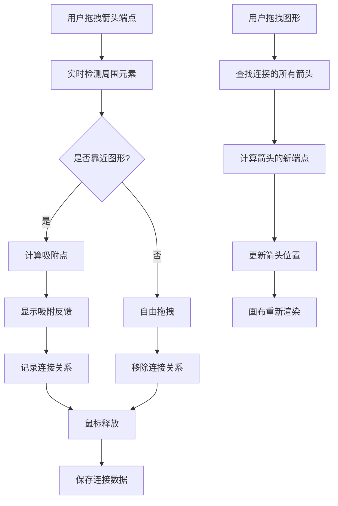
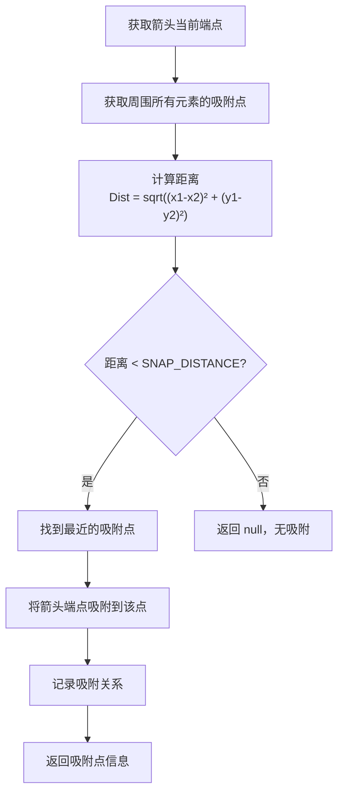

# 画布编辑器 - 箭头吸附功能实现指南

## 功能概述

### 需求说明

实现箭头与图形的智能吸附机制，包括两个关键功能：

1. **箭头端点吸附** - 当箭头的起点或终点靠近其他图形时，产生视觉吸附效果
2. **连接关系维护** - 移动图形时，连接到该图形的箭头自动跟随调整位置

### 核心特性

✅ **自动吸附检测**：箭头靠近图形边界时自动吸附
✅ **视觉反馈**：显示吸附对象和吸附点的高亮
✅ **连接关系存储**：记录箭头与图形的连接信息
✅ **动态调整**：移动图形时，连接的箭头随之移动
✅ **智能更新**：支持多个箭头连接到同一图形

---

## 架构设计

### 整体流程



### 数据结构扩展

#### 增强 ShapeElement 类型

```typescript
interface ShapeElement extends BaseElement {
  // ... 现有字段 ...
  
  // 新增：连接关系跟踪
  connectedArrows?: {
    arrowId: string;      // 箭头元素 ID
    point: 'start' | 'end';  // 该箭头的哪个端点连接到此元素
    snapPoint: 'center' | 'left' | 'right' | 'top' | 'bottom';  // 吸附点类型
    offsetX?: number;     // 相对于吸附点的 X 偏移
    offsetY?: number;     // 相对于吸附点的 Y 偏移
  }[];
}

// 或创建独立的连接关系表
interface ArrowConnection {
  arrowId: string;
  targetElementId: string;
  point: 'start' | 'end';        // 箭头的起点或终点
  snapPoint: 'center' | 'left' | 'right' | 'top' | 'bottom';
  offsetX: number;
  offsetY: number;
}
```

### 吸附点类型定义

```typescript
enum SnapPointType {
  CENTER = 'center',      // 中心点
  LEFT = 'left',          // 左边中点
  RIGHT = 'right',        // 右边中点
  TOP = 'top',            // 上边中点
  BOTTOM = 'bottom',      // 下边中点
  TOP_LEFT = 'top-left',
  TOP_RIGHT = 'top-right',
  BOTTOM_LEFT = 'bottom-left',
  BOTTOM_RIGHT = 'bottom-right',
}

interface SnapPoint {
  type: SnapPointType;
  x: number;              // 画布坐标
  y: number;
  elementId: string;      // 所属元素 ID
}
```

---

## 箭头端点吸附检测

### 算法概述



### 吸附点生成函数

```typescript
/**
 * 获取元素的所有吸附点
 */
export const getElementSnapPoints = (
  element: CanvasElement,
  pointTypes: SnapPointType[] = [
    SnapPointType.CENTER,
    SnapPointType.LEFT,
    SnapPointType.RIGHT,
    SnapPointType.TOP,
    SnapPointType.BOTTOM,
  ]
): SnapPoint[] => {
  const points: SnapPoint[] = [];
  
  const centerX = element.x + element.width / 2;
  const centerY = element.y + element.height / 2;
  
  const snapPoints = {
    [SnapPointType.CENTER]: { x: centerX, y: centerY },
    [SnapPointType.LEFT]: { x: element.x, y: centerY },
    [SnapPointType.RIGHT]: { x: element.x + element.width, y: centerY },
    [SnapPointType.TOP]: { x: centerX, y: element.y },
    [SnapPointType.BOTTOM]: { x: centerX, y: element.y + element.height },
    [SnapPointType.TOP_LEFT]: { x: element.x, y: element.y },
    [SnapPointType.TOP_RIGHT]: { x: element.x + element.width, y: element.y },
    [SnapPointType.BOTTOM_LEFT]: { x: element.x, y: element.y + element.height },
    [SnapPointType.BOTTOM_RIGHT]: { x: element.x + element.width, y: element.y + element.height },
  };
  
  pointTypes.forEach((type) => {
    if (snapPoints[type]) {
      points.push({
        type,
        x: snapPoints[type].x,
        y: snapPoints[type].y,
        elementId: element.id,
      });
    }
  });
  
  return points;
};

/**
 * 检测箭头端点是否应该吸附到某个元素
 * 返回吸附点和距离信息
 */
export const detectArrowSnap = (
  arrowPoint: { x: number; y: number },  // 箭头端点坐标
  arrowId: string,
  otherElements: CanvasElement[],
  snapDistance: number = 20  // 吸附距离阈值（像素）
): { snapPoint: SnapPoint; distance: number } | null => {
  let closestSnap: { snapPoint: SnapPoint; distance: number } | null = null;
  let minDistance = snapDistance;
  
  // 遍历所有其他元素
  otherElements.forEach((element) => {
    // 跳过箭头元素
    if (element.type === 'arrow') return;
    
    // 获取元素的所有吸附点
    const snapPoints = getElementSnapPoints(element);
    
    // 检查每个吸附点的距离
    snapPoints.forEach((snap) => {
      const distance = Math.sqrt(
        Math.pow(arrowPoint.x - snap.x, 2) +
        Math.pow(arrowPoint.y - snap.y, 2)
      );
      
      if (distance < minDistance) {
        minDistance = distance;
        closestSnap = { snapPoint: snap, distance };
      }
    });
  });
  
  return closestSnap;
};
```

### ArrowHandles 组件修改

在 `src/components/ArrowHandles.tsx` 中添加吸附逻辑：

```typescript
export const ArrowHandles: React.FC<ArrowHandlesProps> = ({
  element,
  viewport,
  onUpdateArrowPoint,
  elements,  // 新增参数：所有元素
}) => {
  const [snapInfo, setSnapInfo] = useState<{
    point: 'start' | 'end';
    snapPoint: SnapPoint | null;
  }>({
    point: 'start',
    snapPoint: null,
  });

  const handleMouseDown = (point: 'start' | 'end') => (e: React.MouseEvent) => {
    e.stopPropagation();
    
    const startX = e.clientX;
    const startY = e.clientY;
    const initialPoint = point === 'start' ? element.arrowStart : element.arrowEnd;
    
    const handleMouseMove = (moveEvent: MouseEvent) => {
      const deltaX = (moveEvent.clientX - startX) / viewport.scale;
      const deltaY = (moveEvent.clientY - startY) / viewport.scale;
      
      const newX = initialPoint!.x + deltaX;
      const newY = initialPoint!.y + deltaY;
      
      // 获取画布坐标的绝对位置
      const absoluteX = element.x + newX;
      const absoluteY = element.y + newY;
      
      // 检测吸附
      const otherElements = elements.filter(
        (el) => el.id !== element.id && el.type !== 'arrow'
      );
      
      const snap = detectArrowSnap(
        { x: absoluteX, y: absoluteY },
        element.id,
        otherElements
      );
      
      // 更新状态（用于渲染反馈）
      setSnapInfo({
        point,
        snapPoint: snap?.snapPoint || null,
      });
      
      // 如果有吸附点，吸附到该点
      if (snap) {
        const relativeX = snap.snapPoint.x - element.x;
        const relativeY = snap.snapPoint.y - element.y;
        onUpdateArrowPoint(point, relativeX, relativeY);
      } else {
        // 否则自由移动
        onUpdateArrowPoint(point, newX, newY);
      }
    };
    
    const handleMouseUp = () => {
      document.removeEventListener('mousemove', handleMouseMove);
      document.removeEventListener('mouseup', handleMouseUp);
    };
    
    document.addEventListener('mousemove', handleMouseMove);
    document.addEventListener('mouseup', handleMouseUp);
  };

  return (
    <>
      {/* 起点控制点 */}
      <div
        onMouseDown={handleMouseDown('start')}
        style={{
          position: 'absolute',
          left: startScreenX - handleSize / 2,
          top: startScreenY - handleSize / 2,
          width: handleSize,
          height: handleSize,
          backgroundColor: snapInfo.point === 'start' && snapInfo.snapPoint
            ? '#f59e0b'  // 吸附时高亮
            : '#10b981',
          border: '2px solid white',
          borderRadius: '50%',
          cursor: 'move',
          boxShadow: '0 2px 4px rgba(0,0,0,0.2)',
          transition: 'background-color 0.1s',
          zIndex: 1001,
        }}
        title="拖动调整箭头起点"
      />
      
      {/* 终点控制点 */}
      <div
        onMouseDown={handleMouseDown('end')}
        style={{
          position: 'absolute',
          left: endScreenX - handleSize / 2,
          top: endScreenY - handleSize / 2,
          width: handleSize,
          height: handleSize,
          backgroundColor: snapInfo.point === 'end' && snapInfo.snapPoint
            ? '#f59e0b'  // 吸附时高亮
            : '#ef4444',
          border: '2px solid white',
          borderRadius: '50%',
          cursor: 'move',
          boxShadow: '0 2px 4px rgba(0,0,0,0.2)',
          transition: 'background-color 0.1s',
          zIndex: 1001,
        }}
        title="拖动调整箭头终点"
      />
    </>
  );
};
```

---

## 连接关系维护

### 实现策略

#### 方案 A：字段扩展（推荐）

在 `ShapeElement` 中添加 `connectedArrows` 字段，存储所有连接信息。

**优点：**
- 数据自包含，便于序列化和持久化
- 删除元素时可以同时删除连接关系

**缺点：**
- ShapeElement 类型变复杂
- 需要同时维护箭头端点和连接关系

#### 方案 B：全局连接表（更推荐）

在 Canvas State 中维护独立的连接关系数组。

**优点：**
- 数据解耦，职责清晰
- 查询方便（反向索引）
- 支持多对多关系

**缺点：**
- 需要额外的状态管理

### 方案 B 实现（推荐）

#### 新增 Hook 方法

在 `src/hooks/useCanvasState.ts` 中添加：

```typescript
// 连接关系存储
const [arrowConnections, setArrowConnections] = useState<ArrowConnection[]>([]);

/**
 * 建立箭头与元素的连接关系
 */
const connectArrowToElement = useCallback(
  (
    arrowId: string,
    targetElementId: string,
    point: 'start' | 'end',
    snapPointType: SnapPointType,
    offsetX: number = 0,
    offsetY: number = 0
  ) => {
    setArrowConnections((prev) => {
      // 移除该箭头该端点的旧连接
      const filtered = prev.filter(
        (conn) => !(conn.arrowId === arrowId && conn.point === point)
      );
      
      // 添加新连接
      return [
        ...filtered,
        {
          arrowId,
          targetElementId,
          point,
          snapPoint: snapPointType,
          offsetX,
          offsetY,
        },
      ];
    });
  },
  []
);

/**
 * 断开连接
 */
const disconnectArrow = useCallback((arrowId: string, point?: 'start' | 'end') => {
  setArrowConnections((prev) => {
    if (point) {
      return prev.filter((conn) => !(conn.arrowId === arrowId && conn.point === point));
    }
    return prev.filter((conn) => conn.arrowId !== arrowId);
  });
}, []);

/**
 * 获取连接到某个元素的所有箭头
 */
const getConnectedArrows = useCallback(
  (elementId: string): ArrowConnection[] => {
    return arrowConnections.filter((conn) => conn.targetElementId === elementId);
  },
  [arrowConnections]
);

/**
 * 当元素被移动时，更新连接的箭头
 */
const updateConnectedArrows = useCallback(
  (movedElementId: string) => {
    const connectedArrows = getConnectedArrows(movedElementId);
    const movedElement = elements.find((el) => el.id === movedElementId)!;
    
    connectedArrows.forEach((connection) => {
      const arrow = elements.find((el) => el.id === connection.arrowId) as ShapeElement;
      if (!arrow || arrow.type !== 'arrow') return;
      
      // 计算新的吸附点
      const snapPoint = getElementSnapPoints(movedElement, [connection.snapPoint])[0];
      if (!snapPoint) return;
      
      // 计算相对于箭头边界框的坐标
      const relativeX = snapPoint.x - arrow.x + connection.offsetX;
      const relativeY = snapPoint.y - arrow.y + connection.offsetY;
      
      // 更新箭头端点
      const point = connection.point;
      setElements((prev) =>
        prev.map((el) => {
          if (el.id !== arrow.id) return el;
          
          const updatedArrow = { ...el } as ShapeElement;
          if (point === 'start') {
            updatedArrow.arrowStart = { x: relativeX, y: relativeY };
          } else {
            updatedArrow.arrowEnd = { x: relativeX, y: relativeY };
          }
          return updatedArrow;
        })
      );
    });
  },
  [elements, getConnectedArrows]
);

export const useCanvasState = () => {
  // ... 现有代码 ...
  
  return {
    // ... 现有 API ...
    arrowConnections,
    connectArrowToElement,
    disconnectArrow,
    getConnectedArrows,
    updateConnectedArrows,
  };
};
```

---

## 图形移动时的箭头更新

### 集成到拖拽流程

修改 `src/components/CanvasView.tsx` 中的 `handleMouseUp` 函数：

```typescript
const handleMouseUp = useCallback(() => {
  if (editingTextId) return;
  
  if (mode === InteractionMode.SELECTING && selectionBox) {
    // ... 框选逻辑 ...
  }

  // 新增：图形移动后更新箭头
  if (mode === InteractionMode.DRAGGING && isDragging) {
    // 更新每个被移动元素连接的箭头
    selectedIds.forEach((elementId) => {
      const element = elements.find((el) => el.id === elementId);
      if (element && element.type !== 'arrow') {
        updateConnectedArrows(elementId);
      }
    });
    
    setIsDragging(false);
  }

  setMode(InteractionMode.NONE);
  setSelectionBox(null);
  setDragStart(null);
  setElementStartPos(new Map());
  setResizeHandle(null);
  setResizeStartData(null);
  setGuidelines([]);
}, [
  mode,
  selectionBox,
  isDragging,
  editingTextId,
  selectedIds,
  elements,
  updateConnectedArrows,
]);
```

### 元素删除时处理连接

```typescript
/**
 * 删除元素时，同时处理其连接的箭头
 */
const deleteElementsWithArrows = useCallback(
  (ids: string[]) => {
    // 1. 找到所有相关的箭头连接
    const arrowsToDelete: string[] = [];
    ids.forEach((elementId) => {
      const connections = getConnectedArrows(elementId);
      connections.forEach((conn) => {
        if (!arrowsToDelete.includes(conn.arrowId)) {
          arrowsToDelete.push(conn.arrowId);
        }
      });
    });
    
    // 2. 如果用户也选了这些箭头，合并到删除列表
    const allToDelete = new Set([...ids, ...arrowsToDelete]);
    
    // 3. 删除元素
    deleteElements(Array.from(allToDelete));
    
    // 4. 删除连接关系
    ids.forEach((elementId) => {
      const connections = getConnectedArrows(elementId);
      connections.forEach((conn) => {
        disconnectArrow(conn.arrowId);
      });
    });
  },
  [getConnectedArrows, deleteElements, disconnectArrow]
);
```

---

## 吸附反馈渲染

### 视觉效果

创建 `src/components/ArrowSnapFeedback.tsx`：

```typescript
interface ArrowSnapFeedbackProps {
  snapInfo: {
    snapPoint: SnapPoint | null;
    isSnapping: boolean;
  } | null;
  viewport: ViewportState;
  canvasWidth: number;
  canvasHeight: number;
}

export const ArrowSnapFeedback: React.FC<ArrowSnapFeedbackProps> = ({
  snapInfo,
  viewport,
  canvasWidth,
  canvasHeight,
}) => {
  if (!snapInfo?.snapPoint || !snapInfo.isSnapping) return null;

  const snap = snapInfo.snapPoint;
  
  // 转换为屏幕坐标
  const screenX = snap.x * viewport.scale + viewport.x;
  const screenY = snap.y * viewport.scale + viewport.y;
  
  // 检查是否在可视区域内
  if (
    screenX < 0 || screenX > canvasWidth ||
    screenY < 0 || screenY > canvasHeight
  ) {
    return null;
  }

  return (
    <>
      {/* 吸附点高亮圆圈 */}
      <div
        style={{
          position: 'absolute',
          left: screenX,
          top: screenY,
          width: 20,
          height: 20,
          border: '2px solid #f59e0b',
          borderRadius: '50%',
          transform: 'translate(-50%, -50%)',
          pointerEvents: 'none',
          zIndex: 999,
          boxShadow: '0 0 8px rgba(245, 158, 11, 0.5)',
        }}
      />
      
      {/* 吸附提示文本 */}
      <div
        style={{
          position: 'absolute',
          left: screenX + 15,
          top: screenY - 15,
          padding: '4px 8px',
          backgroundColor: '#f59e0b',
          color: 'white',
          borderRadius: '4px',
          fontSize: '12px',
          whiteSpace: 'nowrap',
          pointerEvents: 'none',
          zIndex: 999,
          boxShadow: '0 2px 4px rgba(0,0,0,0.2)',
        }}
      >
        已吸附：{snap.type}
      </div>
    </>
  );
};
```

在 CanvasView 中使用：

```tsx
{snapInfo && (
  <ArrowSnapFeedback
    snapInfo={snapInfo}
    viewport={viewport}
    canvasWidth={canvasRef.current?.width || 0}
    canvasHeight={canvasRef.current?.height || 0}
  />
)}
```

---

## 性能优化

### 1. 吸附检测优化

```typescript
/**
 * 使用空间分割加速吸附检测
 */
export const detectArrowSnapFast = (
  arrowPoint: { x: number; y: number },
  arrowId: string,
  otherElements: CanvasElement[],
  snapDistance: number = 20
) => {
  // 1. 过滤距离太远的元素
  const nearbyElements = otherElements.filter((el) => {
    const centerX = el.x + el.width / 2;
    const centerY = el.y + el.height / 2;
    const distance = Math.sqrt(
      Math.pow(arrowPoint.x - centerX, 2) +
      Math.pow(arrowPoint.y - centerY, 2)
    );
    return distance < snapDistance * 5; // 粗过滤范围
  });
  
  // 2. 只对附近的元素进行精细检测
  return detectArrowSnap(arrowPoint, arrowId, nearbyElements, snapDistance);
};
```

### 2. 连接关系缓存

```typescript
// 使用 useMemo 缓存计算结果
const connectedArrowsByElement = useMemo(() => {
  const map = new Map<string, ArrowConnection[]>();
  arrowConnections.forEach((conn) => {
    if (!map.has(conn.targetElementId)) {
      map.set(conn.targetElementId, []);
    }
    map.get(conn.targetElementId)!.push(conn);
  });
  return map;
}, [arrowConnections]);
```

### 3. 批量更新优化

```typescript
// 移动多个元素时，批量更新箭头
const updateMultipleConnectedArrows = useCallback(
  (movedElementIds: string[]) => {
    const updates: Map<string, Partial<ShapeElement>> = new Map();
    
    // 收集所有更新
    movedElementIds.forEach((elementId) => {
      const connections = getConnectedArrows(elementId);
      connections.forEach((conn) => {
        // ... 计算新位置 ...
      });
    });
    
    // 一次性应用所有更新
    setElements((prev) =>
      prev.map((el) => (updates.has(el.id) ? { ...el, ...updates.get(el.id) } : el))
    );
  },
  [getConnectedArrows]
);
```

---

## 实现清单

### 第一阶段：基础吸附

- [ ] 定义 `SnapPointType` 枚举和 `SnapPoint` 接口
- [ ] 实现 `getElementSnapPoints()` 函数
- [ ] 实现 `detectArrowSnap()` 检测函数
- [ ] 修改 `ArrowHandles` 组件添加吸附逻辑
- [ ] 添加吸附视觉反馈

### 第二阶段：连接关系

- [ ] 定义 `ArrowConnection` 接口
- [ ] 在 `useCanvasState` 中添加连接状态管理
- [ ] 实现 `connectArrowToElement()` 方法
- [ ] 实现 `disconnectArrow()` 方法
- [ ] 实现 `getConnectedArrows()` 查询方法

### 第三阶段：动态更新

- [ ] 实现 `updateConnectedArrows()` 方法
- [ ] 集成到拖拽流程（handleMouseUp）
- [ ] 处理元素删除时的箭头清理
- [ ] 处理缩放操作时的箭头更新

### 第四阶段：优化与打磨

- [ ] 性能优化（空间分割、缓存）
- [ ] 持久化连接关系到 LocalStorage
- [ ] 测试多个箭头连接到同一元素
- [ ] 测试删除元素后的连接清理

---

## 配置参数

```typescript
// 吸附相关常数
export const ARROW_SNAP_CONFIG = {
  // 吸附距离阈值（像素）
  SNAP_DISTANCE: 20,
  
  // 吸附反馈显示时长（毫秒）
  SNAP_FEEDBACK_DURATION: 300,
  
  // 吸附点类型（优先级从高到低）
  SNAP_POINT_PRIORITY: [
    'center',
    'left',
    'right',
    'top',
    'bottom',
  ],
  
  // 吸附点高亮颜色
  SNAP_HIGHLIGHT_COLOR: '#f59e0b',
  
  // 吸附控制点颜色
  SNAP_HANDLE_COLOR: '#f59e0b',
};
```

---

## 测试场景

| 场景 | 步骤 | 预期结果 |
|------|------|--------|
| 基础吸附 | 1. 拖拽箭头端点靠近图形<br/>2. 端点距离图形中心 < 20px | 端点自动吸附到图形，高亮显示 |
| 连接保持 | 1. 吸附箭头端点<br/>2. 移动被连接的图形 | 箭头跟随移动，连接关系保持 |
| 多连接 | 1. 两条箭头连接到同一图形<br/>2. 移动该图形 | 两条箭头都随之移动 |
| 删除清理 | 1. 建立箭头连接<br/>2. 删除被连接元素 | 连接关系自动清理 |
| 吸附取消 | 1. 连接箭头<br/>2. 拖拽箭头端点离开图形 > 20px | 吸附关系断开，箭头自由移动 |

---

## 常见问题

### Q1: 如何避免循环引用？

A: 箭头通常不会作为连接对象（即箭头的端点不会连接到另一条箭头）。如果需要支持，使用递归检测防止循环。

### Q2: 多选元素移动时如何处理？

A: 在 `handleMouseUp` 时遍历所有被移动的元素，分别调用 `updateConnectedArrows()`。使用批量更新优化性能。

### Q3: 如何处理 Undo/Redo？

A: 将连接关系作为状态的一部分保存到历史记录中。

### Q4: 箭头旋转时如何计算吸附点？

A: 当前不考虑旋转。如果需要支持，在计算吸附点时应用反向旋转变换。

