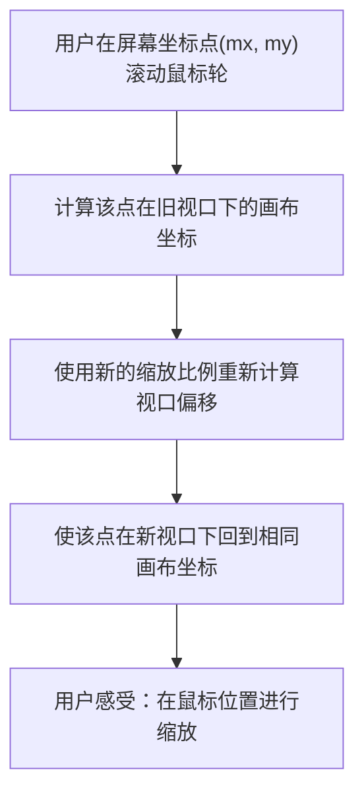
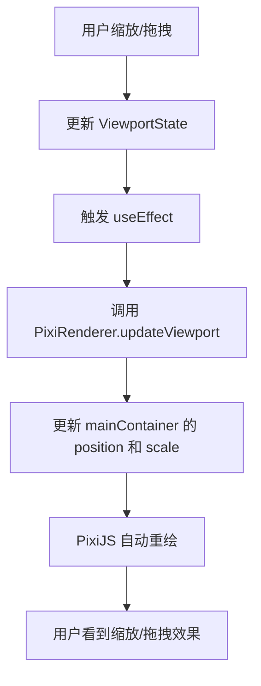
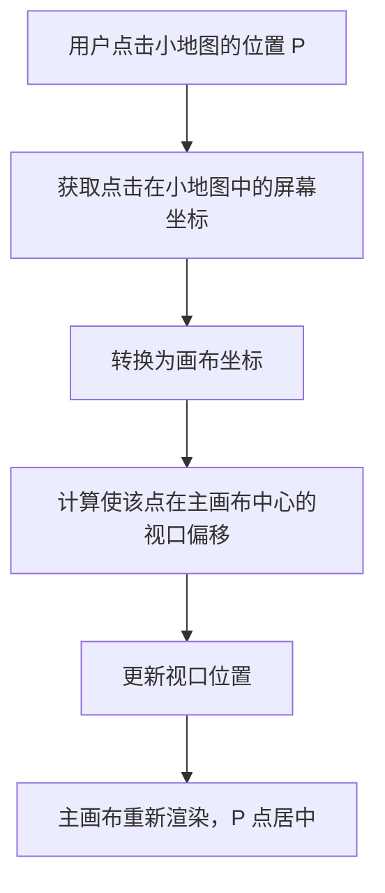
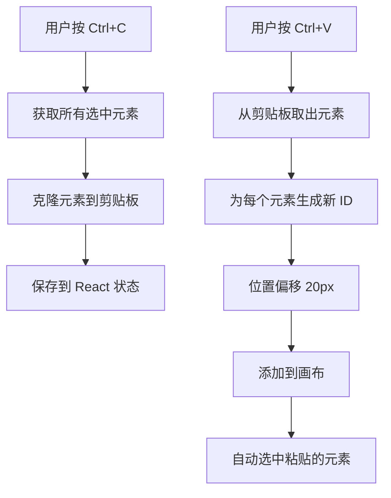
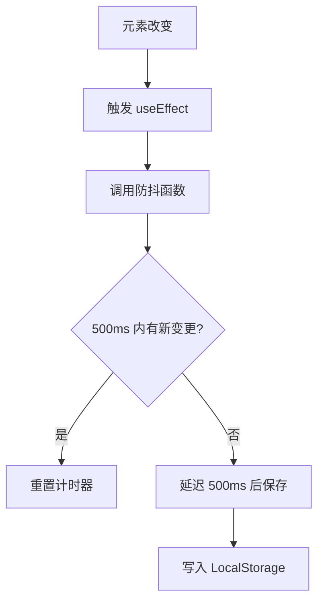
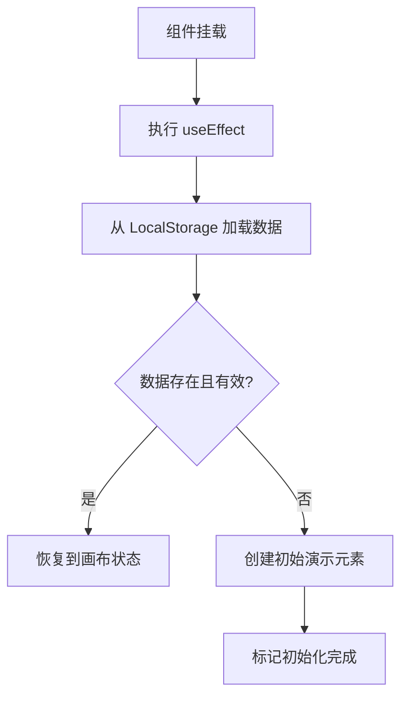
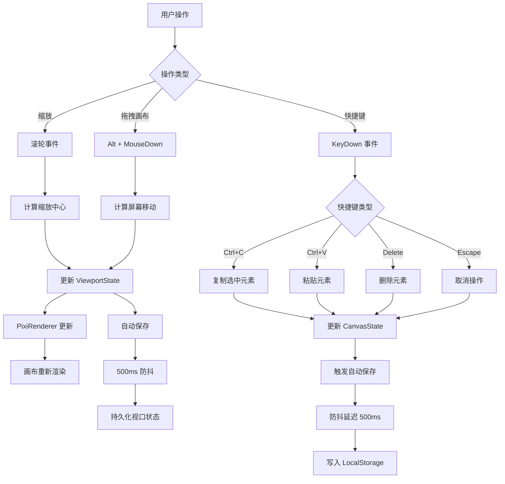

# 画布编辑器 - 画布交互功能实现细节

## 目录

1. [无限画布缩放与拖拽](#无限画布缩放与拖拽)
2. [MiniMap 小地图功能](#minimap-小地图功能)
3. [快捷键系统](#快捷键系统)
4. [数据持久化](#数据持久化)

---

## 无限画布缩放与拖拽

### 功能概述

支持无限大的画布，用户可以：
- ✅ **无限缩放**：鼠标滚轮缩放，保持鼠标位置不变
- ✅ **画布拖拽**：Alt + 鼠标拖拽平移画布
- ✅ **平滑交互**：缩放中心点计算精确

### 数据结构

```typescript
interface ViewportState {
  x: number;        // 视口在画布上的 X 偏移（屏幕坐标系）
  y: number;        // 视口在画布上的 Y 偏移（屏幕坐标系）
  scale: number;    // 缩放比例（1.0 = 100%，0.1 = 10%，2.0 = 200%）
}
```

**坐标转换关系：**

```
屏幕空间                     画布空间
(鼠标位置)                   (元素位置)
   ↓                            ↓
   |                            |
   |-- viewport.x --|
   |  |--- scale ---|
   |                            |
   
转换公式：
canvasX = (screenX - viewport.x) / viewport.scale
canvasY = (screenY - viewport.y) / viewport.scale

逆转换：
screenX = canvasX * viewport.scale + viewport.x
screenY = canvasY * viewport.scale + viewport.y
```

### 缩放实现原理

**关键问题：** 缩放时如何保持鼠标位置不变？

**解决方案：** 三步计算法



**详细算法：**

```typescript
// 第1步：获取鼠标在画布中的位置（在缩放前）
const beforeX = (mouseX - viewport.x) / viewport.scale;
const beforeY = (mouseY - viewport.y) / viewport.scale;

// 第2步：计算新的缩放比例
const zoomDelta = 1.2; // 每次滚轮增量
const newScale = viewport.scale * zoomDelta;

// 限制缩放范围：0.1x ~ 5x
const minScale = 0.1;
const maxScale = 5;
const clampedScale = Math.max(minScale, Math.min(newScale, maxScale));

// 第3步：计算使鼠标点保持在同一画布位置的新视口位置
const afterX = mouseX - beforeX * clampedScale;
const afterY = mouseY - beforeY * clampedScale;

// 结果
const newViewport = {
  x: afterX,
  y: afterY,
  scale: clampedScale
};
```

**实现流程：**

```typescript
const handleWheel = (e: WheelEvent) => {
  e.preventDefault();
  
  const { clientX, clientY, deltaY } = e;
  
  // 计算缩放方向
  const zoomDelta = deltaY > 0 ? 1 / 1.2 : 1.2;
  
  // 应用三步计算法
  const beforeX = (clientX - viewport.x) / viewport.scale;
  const beforeY = (clientY - viewport.y) / viewport.scale;
  
  const newScale = viewport.scale * zoomDelta;
  const finalScale = Math.max(0.1, Math.min(5, newScale));
  
  const newX = clientX - beforeX * finalScale;
  const newY = clientY - beforeY * finalScale;
  
  onUpdateViewport({
    x: newX,
    y: newY,
    scale: finalScale
  });
};
```

### 画布拖拽实现

**交互模式：** Alt + 鼠标拖拽

```typescript
const handleMouseDown = (e: React.MouseEvent) => {
  // Alt 键判断画布拖拽
  if (e.altKey) {
    setMode(InteractionMode.PANNING);
    setDragStart({ x: e.clientX, y: e.clientY });
    return;
  }
  
  // 其他逻辑...
};

const handleMouseMove = (e: React.MouseEvent) => {
  if (mode === InteractionMode.PANNING && dragStart) {
    // 计算屏幕坐标差
    const deltaX = e.clientX - dragStart.x;
    const deltaY = e.clientY - dragStart.y;
    
    // 更新视口（相对移动）
    onUpdateViewport({
      x: viewport.x + deltaX,
      y: viewport.y + deltaY
    });
    
    // 更新拖拽起点以实现连续移动
    setDragStart({ x: e.clientX, y: e.clientY });
  }
};

const handleMouseUp = () => {
  if (mode === InteractionMode.PANNING) {
    setMode(InteractionMode.NONE);
    setDragStart(null);
  }
};
```

### 视口更新与渲染

**PixiRenderer 中的应用：**

```typescript
public updateViewport(x: number, y: number, scale: number): void {
  if (!this.app) return;
  
  // 设置主容器的变换
  this.mainContainer.position.x = x;
  this.mainContainer.position.y = y;
  this.mainContainer.scale.x = scale;
  this.mainContainer.scale.y = scale;
}
```

**渲染流程：**



---

## MiniMap 小地图功能

### 功能概述

MiniMap（小地图）是右下角的 200x200px 小窗口，显示：
- ✅ 整个画布内容的缩略图
- ✅ 当前视口的高亮矩形（红色透明框）
- ✅ 点击小地图快速导航视口
- ✅ 拖拽视口框调整视口位置

### 数据结构

```typescript
interface MiniMapProps {
  elements: CanvasElement[];           // 所有元素
  viewport: ViewportState;             // 当前视口
  canvasWidth: number;                 // 主画布宽度
  canvasHeight: number;                // 主画布高度
  onViewportChange: (updates: {       // 视口更新回调
    x?: number;
    y?: number;
    scale?: number;
  }) => void;
}

// MiniMap 内部状态
interface MiniMapState {
  isDragging: boolean;                // 是否拖拽视口框
  minimapSize: number;               // 小地图尺寸（200px）
  padding: number;                    // 内边距（10px）
  minimapScale: number;              // 小地图的缩放比例
  contentBBox: BoundingBox;          // 所有元素的边界框
}
```

### 核心算法

#### 1. 计算小地图的缩放比例

**问题：** 如何把无限大的画布压缩到 200x200 的小地图里？

**方案：** 根据内容的边界框和视口大小计算缩放比例

```typescript
const getMinimapScale = () => {
  if (!contentBBox) return 1;
  
  // 可用空间（减去内边距）
  const availableWidth = minimapSize - padding * 2;   // 180px
  const availableHeight = minimapSize - padding * 2;  // 180px
  
  // 考虑画布内容的大小和当前视口大小
  const contentWidth = contentBBox.width;
  const contentHeight = contentBBox.height;
  
  // 总大小 = max(内容大小, 当前视口大小)
  const totalWidth = Math.max(
    contentWidth,
    canvasWidth / viewport.scale
  );
  const totalHeight = Math.max(
    contentHeight,
    canvasHeight / viewport.scale
  );
  
  // 计算各轴的缩放比例
  const scaleX = totalWidth > 0 ? availableWidth / totalWidth : 1;
  const scaleY = totalHeight > 0 ? availableHeight / totalHeight : 1;
  
  // 取较小值保持宽高比，最大不超过 1:1
  return Math.min(scaleX, scaleY, 1);
};
```

**可视化：**

```
原始画布空间（无限大）
┌────────────────────────────────────┐
│                                    │
│   ┌─────────┐  ← 所有元素的范围   │
│   │ content │                      │
│   └─────────┘                      │
│                                    │
│    ▓▓▓▓▓▓▓▓▓  ← 当前视口          │
│                                    │
└────────────────────────────────────┘
           ↓ 使用 minimapScale 缩放
小地图（200x200）
┌──────────────────┐
│ ┌──────────────┐ │
│ │     内容     │ │
│ └──────────────┘ │
│ ▓▓▓▓ 视口  ▓▓▓▓ │
│ ▓▓▓▓▓▓▓▓▓▓▓▓▓▓ │
└──────────────────┘
```

#### 2. 绘制小地图

```typescript
useEffect(() => {
  const canvas = canvasRef.current;
  if (!canvas) return;
  
  const ctx = canvas.getContext('2d');
  if (!ctx) return;
  
  // 背景色
  ctx.fillStyle = '#f5f5f5';
  ctx.fillRect(0, 0, minimapSize, minimapSize);
  
  // 绘制边框
  ctx.strokeStyle = '#d1d5db';
  ctx.lineWidth = 1;
  ctx.strokeRect(0, 0, minimapSize, minimapSize);
  
  if (!contentBBox) return;
  
  // 计算内容在小地图中的位置
  const contentStartX = padding - contentBBox.x * minimapScale;
  const contentStartY = padding - contentBBox.y * minimapScale;
  const contentDrawWidth = contentBBox.width * minimapScale;
  const contentDrawHeight = contentBBox.height * minimapScale;
  
  // 绘制内容背景（代表所有元素）
  ctx.fillStyle = '#ffffff';
  ctx.fillRect(
    contentStartX,
    contentStartY,
    contentDrawWidth,
    contentDrawHeight
  );
  
  // 绘制内容边框
  ctx.strokeStyle = '#9ca3af';
  ctx.lineWidth = 1;
  ctx.strokeRect(
    contentStartX,
    contentStartY,
    contentDrawWidth,
    contentDrawHeight
  );
  
  // 计算并绘制当前视口矩形
  const viewportX = contentStartX + viewport.x * minimapScale / viewport.scale;
  const viewportY = contentStartY + viewport.y * minimapScale / viewport.scale;
  const viewportWidth = (canvasWidth / viewport.scale) * minimapScale;
  const viewportHeight = (canvasHeight / viewport.scale) * minimapScale;
  
  // 红色透明框表示当前视口
  ctx.fillStyle = '#ef4444';
  ctx.globalAlpha = 0.1;
  ctx.fillRect(viewportX, viewportY, viewportWidth, viewportHeight);
  ctx.globalAlpha = 1;
  
  // 视口框边框
  ctx.strokeStyle = '#ef4444';
  ctx.lineWidth = 2;
  ctx.strokeRect(viewportX, viewportY, viewportWidth, viewportHeight);
  
}, [elements, viewport, minimapScale, canvasWidth, canvasHeight, contentBBox]);
```

#### 3. 点击小地图快速导航

```typescript
const handleCanvasClick = useCallback(
  (e: React.MouseEvent<HTMLCanvasElement>) => {
    const canvas = canvasRef.current;
    if (!canvas || !contentBBox) return;
    
    // 获取点击在小地图中的位置
    const rect = canvas.getBoundingClientRect();
    const clickX = e.clientX - rect.left;
    const clickY = e.clientY - rect.top;
    
    // 转换回画布坐标
    const contentStartX = padding - contentBBox.x * minimapScale;
    const contentStartY = padding - contentBBox.y * minimapScale;
    
    const canvasClickX = (clickX - contentStartX) / minimapScale;
    const canvasClickY = (clickY - contentStartY) / minimapScale;
    
    // 计算新的视口位置，使点击点居中
    const newViewportX = canvasClickX * viewport.scale - canvasWidth / 2;
    const newViewportY = canvasClickY * viewport.scale - canvasHeight / 2;
    
    onViewportChange({
      x: newViewportX,
      y: newViewportY
    });
  },
  [contentBBox, minimapScale, viewport.scale, canvasWidth, canvasHeight]
);
```

**流程：**



#### 4. 拖拽小地图的视口框

```typescript
const handleMouseDown = useCallback(() => {
  setIsDragging(true);
}, []);

const handleMouseMove = useCallback(
  (e: MouseEvent) => {
    if (!isDragging || !canvasRef.current || !contentBBox) return;
    
    const canvas = canvasRef.current;
    const rect = canvas.getBoundingClientRect();
    const moveX = e.clientX - rect.left;
    const moveY = e.clientY - rect.top;
    
    // 转换回画布坐标
    const contentStartX = padding - contentBBox.x * minimapScale;
    const contentStartY = padding - contentBBox.y * minimapScale;
    
    const canvasMoveX = (moveX - contentStartX) / minimapScale;
    const canvasMoveY = (moveY - contentStartY) / minimapScale;
    
    // 计算新的视口位置
    const newViewportX = canvasMoveX * viewport.scale - canvasWidth / 2;
    const newViewportY = canvasMoveY * viewport.scale - canvasHeight / 2;
    
    onViewportChange({
      x: newViewportX,
      y: newViewportY
    });
  },
  [isDragging, contentBBox, minimapScale, viewport.scale, canvasWidth, canvasHeight]
);

useEffect(() => {
  if (isDragging) {
    document.addEventListener('mousemove', handleMouseMove);
    document.addEventListener('mouseup', () => setIsDragging(false));
    
    return () => {
      document.removeEventListener('mousemove', handleMouseMove);
      document.removeEventListener('mouseup', handleMouseUp);
    };
  }
}, [isDragging, handleMouseMove, handleMouseUp]);
```

---

## 快捷键系统

### 功能概述

支持常用的键盘快捷键，提升操作效率：
- ✅ **Ctrl/Cmd + C**：复制选中元素
- ✅ **Ctrl/Cmd + V**：粘贴元素
- ✅ **Delete/Backspace**：删除选中元素
- ✅ **Escape**：取消选择或取消当前操作
- ✅ **Alt + 拖拽**：拖拽画布（已在缩放部分介绍）

### 数据结构

```typescript
interface KeyboardEvent {
  key: string;           // 按键名称 ('c', 'v', 'Delete', 'Escape')
  code: string;          // 按键代码
  ctrlKey: boolean;      // Ctrl 键是否按下
  metaKey: boolean;      // Cmd 键是否按下（Mac）
  shiftKey: boolean;     // Shift 键是否按下
  altKey: boolean;       // Alt 键是否按下
}

interface KeyboardShortcut {
  key: string;          // 主按键
  modifier?: 'ctrl' | 'cmd' | 'alt' | 'shift';  // 修饰键
  action: () => void;   // 执行的操作
  description: string;  // 快捷键说明
}
```

### 快捷键映射表

| 快捷键 | 对应事件 | 功能 | 实现位置 |
|--------|---------|------|---------|
| Ctrl/Cmd + C | keydown | 复制选中元素 | App.tsx |
| Ctrl/Cmd + V | keydown | 粘贴元素 | App.tsx |
| Delete / Backspace | keydown | 删除选中元素 | App.tsx |
| Escape | keydown | 取消选择或取消箭头绘制 | App.tsx, CanvasView.tsx |
| Alt + 拖拽 | mousedown | 画布拖拽 | CanvasView.tsx |
| Shift + 拖拽把手 | mousedown | 自由缩放（不保持宽高比） | ResizeHandles.tsx |

### 复制/粘贴实现

**流程图：**



**代码实现：**

```typescript
// useCanvasState.ts
const copySelected = useCallback(() => {
  // 获取所有选中的元素
  const selectedElements = elements.filter((el) =>
    selectedIds.includes(el.id)
  );
  
  // 克隆到剪贴板
  setClipboard(selectedElements.map(cloneElement));
}, [elements, selectedIds]);

const paste = useCallback(() => {
  if (clipboard.length === 0) return;
  
  // 为每个粘贴的元素生成新 ID 和位置偏移
  const pastedElements = clipboard.map((el) => ({
    ...cloneElement(el),
    id: generateId(),
    x: el.x + 20,    // 向右偏移 20px
    y: el.y + 20     // 向下偏移 20px
  }));
  
  // 添加到画布
  setElements((prev) => [...prev, ...pastedElements]);
  
  // 自动选中粘贴的元素
  setSelectedIds(pastedElements.map((el) => el.id));
}, [clipboard]);

// App.tsx 中的快捷键处理
const handleKeyDown = (e: KeyboardEvent) => {
  // Ctrl/Cmd + C: 复制
  if ((e.ctrlKey || e.metaKey) && e.key === 'c') {
    e.preventDefault();
    copySelected();
  }
  
  // Ctrl/Cmd + V: 粘贴
  if ((e.ctrlKey || e.metaKey) && e.key === 'v') {
    e.preventDefault();
    paste();
  }
  
  // Delete/Backspace: 删除
  if (e.key === 'Delete' || e.key === 'Backspace') {
    if (selectedIds.length > 0) {
      e.preventDefault();
      deleteElements(selectedIds);
    }
  }
  
  // Escape: 取消选择
  if (e.key === 'Escape') {
    clearSelection();
  }
};
```

### 删除实现

```typescript
const deleteElements = useCallback((ids: string[]) => {
  // 从元素列表中移除
  setElements((prev) => prev.filter((el) => !ids.includes(el.id)));
  
  // 清除选中状态
  setSelectedIds((prev) => prev.filter((id) => !ids.includes(id)));
}, []);
```

### 事件监听绑定

**关键点：** 需要在全局监听，且依赖项要完整

```typescript
useEffect(() => {
  const handleKeyDown = (e: KeyboardEvent) => {
    // ... 快捷键逻辑
  };
  
  // 在全局 window 上监听（而不是在组件上）
  // 这样即使焦点不在 React 组件上也能捕获
  window.addEventListener('keydown', handleKeyDown);
  
  // 清理监听器
  return () => window.removeEventListener('keydown', handleKeyDown);
}, [selectedIds, copySelected, paste, deleteElements, clearSelection]);
```

### Escape 键的特殊处理

**Escape 键有多重含义：**

```typescript
// CanvasView.tsx 中处理箭头绘制时的 Escape
useEffect(() => {
  const handleKeyDown = (e: KeyboardEvent) => {
    if (e.key === 'Escape' && isDrawingArrow) {
      setArrowStartPoint(null);
      setMode(InteractionMode.NONE);
      if (onCancelArrowDrawing) {
        onCancelArrowDrawing();
      }
    }
  };
  
  window.addEventListener('keydown', handleKeyDown);
  return () => window.removeEventListener('keydown', handleKeyDown);
}, [isDrawingArrow, onCancelArrowDrawing]);

// App.tsx 中处理选择的 Escape
if (e.key === 'Escape') {
  clearSelection();
}
```

---

## 数据持久化

### 功能概述

所有画布数据都自动保存到浏览器 LocalStorage，支持：
- ✅ 页面刷新后自动恢复
- ✅ 浏览器关闭后数据保留
- ✅ 防抖处理避免频繁写入
- ✅ 数据验证确保完整性

### 数据结构

```typescript
interface CanvasState {
  elements: CanvasElement[];    // 所有元素
  selectedIds: string[];         // 选中元素 ID
  viewport: ViewportState;       // 视口状态
}

// LocalStorage 存储格式
{
  "canvas-editor-state": {
    "elements": [ /* CanvasElement[] */ ],
    "selectedIds": [ /* string[] */ ],
    "viewport": { "x": 0, "y": 0, "scale": 1 }
  }
}
```

### 保存机制

**防抖处理流程：**



**实现代码：**

```typescript
// useCanvasState.ts

// 创建防抖函数
const debouncedSave = useCallback(
  debounce((state: CanvasState) => {
    saveCanvasState(state);
  }, 500), // 500ms 防抖延迟
  []
);

// 监听状态变化，自动保存
useEffect(() => {
  if (!initialized) return; // 等待初始化完成
  debouncedSave({ elements, selectedIds, viewport });
}, [elements, viewport, selectedIds, debouncedSave, initialized]);
```

**防抖函数实现（helpers.ts）：**

```typescript
export const debounce = <T extends (...args: any[]) => any>(
  func: T,
  wait: number
): ((...args: Parameters<T>) => void) => {
  let timeout: ReturnType<typeof setTimeout> | null = null;
  
  return function (...args: Parameters<T>) {
    // 清除前一个计时器
    if (timeout) clearTimeout(timeout);
    
    // 设置新的计时器
    timeout = setTimeout(() => {
      func(...args);
      timeout = null;
    }, wait);
  };
};
```

### 加载机制

**初始化流程：**



**加载代码（useCanvasState.ts）：**

```typescript
useEffect(() => {
  const savedState = loadCanvasState();
  
  if (savedState && savedState.elements && savedState.elements.length > 0) {
    // 恢复保存的状态
    setElements([...savedState.elements]);
    setViewport({...savedState.viewport});
  } else {
    // 创建初始元素（演示用）
    createInitialElements();
  }
  
  // 标记初始化完成
  setInitialized(true);
}, []);
```

### 存储和验证

**存储函数（storage.ts）：**

```typescript
const STORAGE_KEY = 'canvas-editor-state';

export const saveCanvasState = (state: CanvasState): void => {
  try {
    // 序列化为 JSON
    const serialized = JSON.stringify(state);
    
    // 写入 LocalStorage
    localStorage.setItem(STORAGE_KEY, serialized);
  } catch (error) {
    // 处理配额超出等错误
    console.error('Failed to save canvas state:', error);
  }
};

export const loadCanvasState = (): CanvasState | null => {
  try {
    // 从 LocalStorage 读取
    const serialized = localStorage.getItem(STORAGE_KEY);
    if (serialized === null) return null;
    
    const state = JSON.parse(serialized);
    
    // 数据验证
    if (!state || typeof state !== 'object') {
      localStorage.removeItem(STORAGE_KEY);
      return null;
    }
    
    // 验证必要字段
    if (!Array.isArray(state.elements) || !state.viewport) {
      localStorage.removeItem(STORAGE_KEY);
      return null;
    }
    
    // 验证每个元素的完整性
    const isValid = state.elements.every((el: any) => {
      // 必要字段检查
      if (!el.id || !el.type) return false;
      
      // 基础字段类型检查
      if (typeof el.x !== 'number' || typeof el.y !== 'number' ||
          typeof el.width !== 'number' || typeof el.height !== 'number') {
        return false;
      }
      
      // 文本元素必须有 content
      if (el.type === 'text' && (!el.content || typeof el.content !== 'string')) {
        return false;
      }
      
      return true;
    });
    
    if (!isValid) {
      localStorage.removeItem(STORAGE_KEY);
      return null;
    }
    
    return state;
  } catch (error) {
    console.error('Failed to load canvas state:', error);
    localStorage.removeItem(STORAGE_KEY);
    return null;
  }
};

export const clearCanvasState = (): void => {
  try {
    localStorage.removeItem(STORAGE_KEY);
  } catch (error) {
    console.error('Failed to clear canvas state:', error);
  }
};
```

### 存储限制与注意事项

**LocalStorage 限制：**

| 限制项 | 值 |
|--------|-----|
| 单域名容量 | 通常 5-10MB |
| 可用容量 | 取决于浏览器和其他网站数据 |
| 数据类型 | 仅支持字符串（需要 JSON 序列化） |
| 异步操作 | 同步阻塞操作 |

**优化策略：**

```typescript
// 1. 防抖处理（已实现）
// 避免频繁写入 LocalStorage
const debouncedSave = debounce(saveCanvasState, 500);

// 2. 数据压缩建议（未来扩展）
// 当数据量大时，可以考虑压缩
import { compress, decompress } from 'lz-string';

const saveCompressed = (state: CanvasState) => {
  const compressed = compress(JSON.stringify(state));
  localStorage.setItem(STORAGE_KEY, compressed);
};

// 3. 定期清理（未来功能）
// 定期清理过期的缓存数据
const cleanupOldCache = () => {
  const timestamp = localStorage.getItem('last-save-time');
  if (timestamp) {
    const daysPassed = (Date.now() - parseInt(timestamp)) / (1000 * 60 * 60 * 24);
    if (daysPassed > 30) {
      clearCanvasState();
    }
  }
};
```

---

## 交互流程总结

### 完整的用户交互流程



### 性能特征

| 操作 | 延迟 | 优化方法 |
|------|------|--------|
| 缩放/拖拽 | <16ms | 使用 PixiJS 的 GPU 加速 |
| 快捷键响应 | <1ms | JavaScript 原生事件 |
| 数据保存 | 500ms (防抖) | 防抖机制避免频繁写入 |
| 数据加载 | <100ms | 同步读取 JSON 文件 |

---

## 总结对照表

| 功能 | 核心文件 | 数据结构 | 关键方法 |
|------|--------|--------|--------|
| 无限缩放 | CanvasView.tsx | ViewportState | handleWheel() |
| 画布拖拽 | CanvasView.tsx | ViewportState | handleMouseDown/Move |
| MiniMap | MiniMap.tsx | MiniMapProps | getMinimapScale() |
| 快捷键 | App.tsx, CanvasView.tsx | KeyboardEvent | handleKeyDown() |
| 数据保存 | storage.ts, useCanvasState.ts | CanvasState | saveCanvasState() |
| 数据加载 | useCanvasState.ts | CanvasState | loadCanvasState() |

