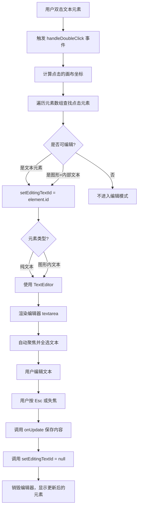
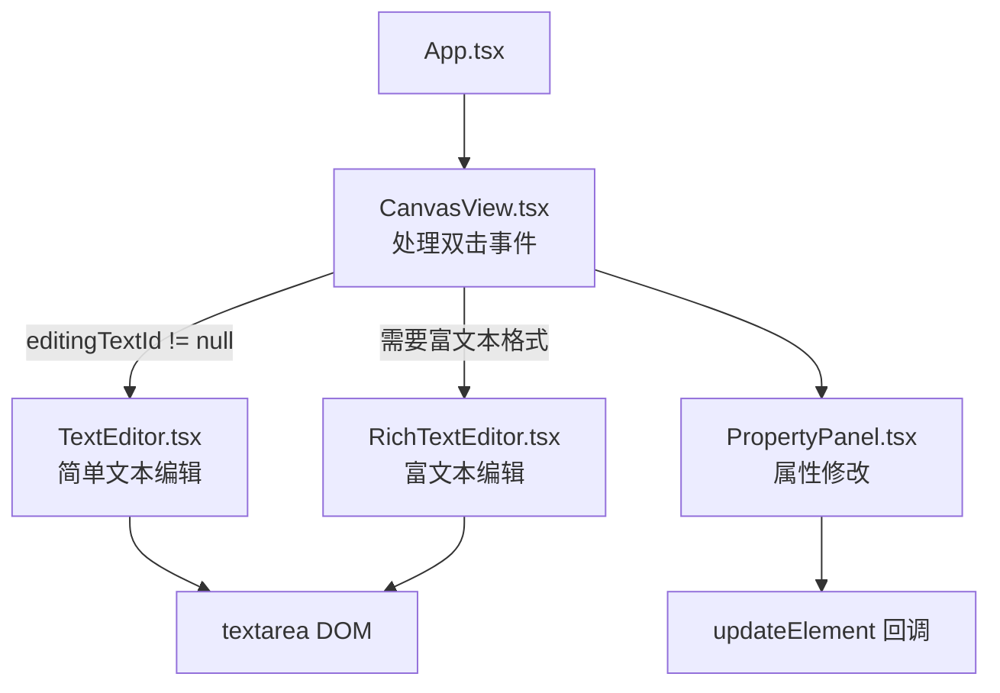
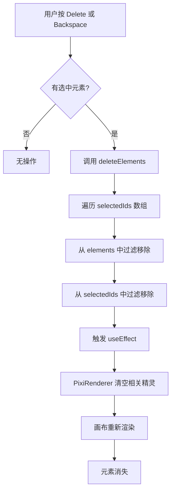
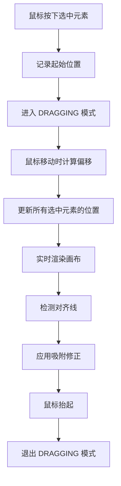
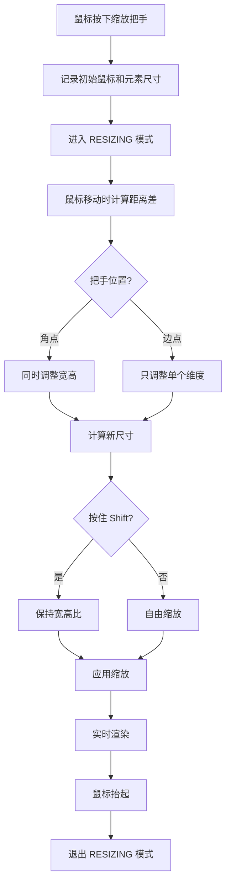
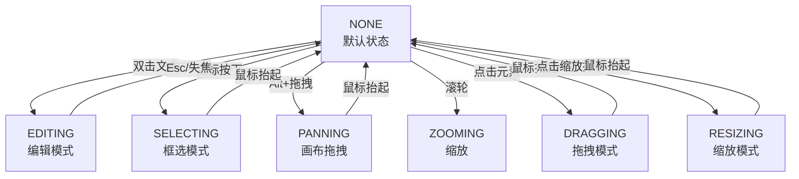
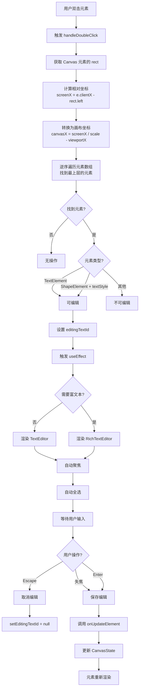

# 画布编辑器 - 元素编辑功能实现细节

## 目录

1. [功能概述](#功能概述)
2. [架构设计](#架构设计)
3. [文本编辑系统](#文本编辑系统)
4. [富文本编辑系统](#富文本编辑系统)
5. [元素操作](#元素操作)
6. [数据结构与流程](#数据结构与流程)
7. [交互细节](#交互细节)

---

## 功能概述

### P0 元素编辑功能

| 功能 | 说明 | 状态 |
|------|------|------|
| **双击文本进入编辑** | 支持双击文本进入编辑，可以输入/删除文本内容 | ✅ |
| **删除选中元素** | 支持对选中元素（单个或多个）删除 | ✅ |
| **拖拽** | 支持对选中元素（单个或多个）拖拽 | ✅ |
| **缩放** | 支持对选中元素（单个或多个）缩放 | ✅ |

### 核心特性

✅ **覆盖式编辑**：编辑器悬浮于原元素之上
✅ **实时预览**：编辑时同步更新样式
✅ **快捷键支持**：Esc 取消编辑，Enter 保存
✅ **视口适应**：编辑器位置和大小随视口变换
✅ **样式继承**：继承原元素的字体、颜色等样式

---

## 架构设计

### 整体流程



### 组件层次



---

## 文本编辑系统

### TextEditor（简单文本编辑）

#### 功能特点

- 覆盖式 textarea 编辑框
- 支持基础文本输入和删除
- 支持样式继承（字体、颜色、背景等）
- 支持快捷键（Esc、Enter、删除键）
- 自动适应视口变换

#### 数据结构

```typescript
interface TextEditorProps {
  element: CanvasElement;          // 被编辑的元素
  viewport: ViewportState;         // 当前视口状态
  onUpdate: (content: string) => void;  // 保存回调
  onClose: () => void;             // 关闭编辑回调
}

interface EditorState {
  text: string;                    // 编辑中的文本
  isEditing: boolean;             // 是否正在编辑
  originalContent: string;        // 原始内容
}
```

#### 核心实现

```typescript
export const TextEditor: React.FC<TextEditorProps> = ({
  element,
  viewport,
  onUpdate,
  onClose,
}) => {
  const [text, setText] = useState((element as any).content || '');
  const inputRef = useRef<HTMLTextAreaElement>(null);

  // 自动聚焦
  useEffect(() => {
    if (inputRef.current) {
      inputRef.current.focus();
      inputRef.current.select();  // 全选已有文本
    }
  }, []);

  // 失焦保存
  const handleBlur = () => {
    onUpdate(text);
    onClose();
  };

  // 快捷键处理
  const handleKeyDown = (e: React.KeyboardEvent) => {
    if (e.key === 'Escape') {
      // Esc：不保存，直接关闭
      onClose();
      e.stopPropagation();
    } else if (e.key === 'Enter' && !e.shiftKey) {
      // Enter：保存并关闭（Shift+Enter 换行）
      e.preventDefault();
      e.stopPropagation();
      handleBlur();
    } else if (e.key === 'Delete' || e.key === 'Backspace') {
      // 阻止事件冒泡（防止触发 canvas 删除）
      e.stopPropagation();
    }
  };

  // 计算编辑器位置（屏幕坐标）
  const left = element.x * viewport.scale + viewport.x;
  const top = element.y * viewport.scale + viewport.y;
  const width = element.width * viewport.scale;
  const height = element.height * viewport.scale;

  // 获取样式（支持文本元素与图形内部文本）
  const styleSource: TextStyle | undefined =
    element.type === 'text'
      ? (element as TextElement).style
      : (element as ShapeElement).textStyle;

  // 缩放后的字号
  const fontSizeScaled = (styleSource?.fontSize || 16) * viewport.scale;

  return (
    <textarea
      ref={inputRef}
      value={text}
      onChange={(e) => setText(e.target.value)}
      onBlur={handleBlur}
      onKeyDown={handleKeyDown}
      style={{
        position: 'absolute',
        left,
        top,
        width,
        height,
        minHeight: height,
        fontSize: fontSizeScaled,
        fontFamily: styleSource?.fontFamily || 'Arial',
        color: styleSource?.color || '#000000',
        backgroundColor: styleSource?.backgroundColor || 'transparent',
        fontWeight: styleSource?.bold ? 'bold' : 'normal',
        fontStyle: styleSource?.italic ? 'italic' : 'normal',
        textDecoration: styleSource?.underline
          ? 'underline'
          : styleSource?.strikethrough
          ? 'line-through'
          : 'none',
        border: '2px solid #3b82f6',
        outline: 'none',
        padding: '6px 8px',
        resize: 'none',
        overflow: 'hidden',
        zIndex: 1000,
        textAlign: element.type !== 'text' ? 'center' : 'left',
        lineHeight: `${fontSizeScaled}px`,
      }}
    />
  );
};
```

#### 位置计算

**从画布坐标转换为屏幕坐标：**

```
编辑器在屏幕上的位置 = 元素在画布上的位置 * 缩放比例 + 视口偏移

left = element.x * viewport.scale + viewport.x
top = element.y * viewport.scale + viewport.y
width = element.width * viewport.scale
height = element.height * viewport.scale
```

#### 快捷键处理

| 快捷键 | 行为 | 说明 |
|--------|------|------|
| Esc | 关闭编辑 | 不保存任何改动 |
| Enter | 保存并关闭 | 仅在无 Shift 时生效 |
| Shift+Enter | 换行 | 在文本中插入换行符 |
| Delete/Backspace | 删除字符 | 阻止事件冒泡 |

---

## 富文本编辑系统

### RichTextEditor（支持范围样式的富文本编辑）

#### 功能特点

- 支持 BIUS（粗体、斜体、下划线、删除线）
- 支持范围样式（不同部分可应用不同样式）
- 支持样式工具栏
- 支持Ctrl快捷键应用格式
- 实时预览格式效果

#### 数据结构

```typescript
interface RichTextEditorProps {
  element: CanvasElement;
  viewport: ViewportState;
  onUpdate: (
    content: string,
    rangeStyles?: TextRangeStyle[]
  ) => void;
  onClose: () => void;
}

interface TextRangeStyle {
  start: number;        // 样式应用的起始位置（字符索引）
  end: number;          // 样式应用的结束位置
  bold?: boolean;       // 粗体
  italic?: boolean;     // 斜体
  underline?: boolean;  // 下划线
  strikethrough?: boolean; // 删除线
}

interface EditorUIState {
  activeFormats: {
    bold: boolean;
    italic: boolean;
    underline: boolean;
    strikethrough: boolean;
  };
  selectionStart: number;  // 当前选中范围的起始
  selectionEnd: number;    // 当前选中范围的结束
}
```

#### 核心实现 - 格式识别

```typescript
// 更新活跃格式（根据选中文本）
const updateActiveFormats = () => {
  if (!textareaRef.current) return;

  const start = textareaRef.current.selectionStart;
  const end = textareaRef.current.selectionEnd;

  setSelectionStart(start);
  setSelectionEnd(end);

  // 1. 找到与选中范围重叠的样式
  const relevantStyles = rangeStyles.filter(
    (style) => !(style.end <= start || style.start >= end)
  );

  // 2. 检查每种格式是否存在
  const hasFormat = (format: keyof typeof activeFormats) => {
    return relevantStyles.some((style) => style[format] === true);
  };

  // 3. 更新活跃格式状态
  setActiveFormats({
    bold: hasFormat('bold'),
    italic: hasFormat('italic'),
    underline: hasFormat('underline'),
    strikethrough: hasFormat('strikethrough'),
  });
};
```

#### 核心实现 - 应用格式

```typescript
// 对选中文本应用格式
const applyFormat = (format: keyof typeof activeFormats) => {
  if (selectionStart === selectionEnd) return; // 没有选中文本

  // 1. 移除与当前范围重叠的相同格式
  const newStyles = rangeStyles.filter((style) => {
    if (
      style[format] &&
      !(style.end <= selectionStart || style.start >= selectionEnd)
    ) {
      // 这个样式与选中范围重叠，且与要应用的格式相同，删除它
      return false;
    }
    return true;
  });

  // 2. 添加新格式
  newStyles.push({
    start: selectionStart,
    end: selectionEnd,
    [format]: true,
  } as TextRangeStyle);

  setRangeStyles(newStyles);

  // 3. 更新 UI
  setActiveFormats((prev) => ({
    ...prev,
    [format]: !prev[format],
  }));

  // 4. 重新聚焦并保持选中范围
  setTimeout(() => {
    if (textareaRef.current) {
      textareaRef.current.focus();
      textareaRef.current.setSelectionRange(selectionStart, selectionEnd);
    }
  }, 0);
};
```

#### 工具栏实现

```typescript
// BIUS 格式按钮
<div style={{ display: 'flex', gap: '4px', padding: '8px' }}>
  <button
    onMouseDown={(e) => {
      e.preventDefault();
      applyFormat('bold');
    }}
    style={{
      padding: '4px 8px',
      backgroundColor: activeFormats.bold ? '#3b82f6' : '#ffffff',
      color: activeFormats.bold ? '#ffffff' : '#000000',
      border: '1px solid #d1d5db',
      borderRadius: '4px',
      cursor: 'pointer',
      fontWeight: 'bold',
      fontSize: '12px',
    }}
    title="粗体 (Ctrl+B)"
  >
    <strong>B</strong>
  </button>

  <button
    onMouseDown={(e) => {
      e.preventDefault();
      applyFormat('italic');
    }}
    style={{
      backgroundColor: activeFormats.italic ? '#3b82f6' : '#ffffff',
      // ...其他样式
    }}
    title="斜体 (Ctrl+I)"
  >
    <em>I</em>
  </button>

  {/* 类似的 U（下划线）和 S（删除线）按钮 */}
</div>
```

#### 快捷键支持

```typescript
const handleKeyDown = (e: React.KeyboardEvent) => {
  // Ctrl+B：粗体
  if ((e.ctrlKey || e.metaKey) && e.key === 'b') {
    e.preventDefault();
    applyFormat('bold');
  }
  // Ctrl+I：斜体
  else if ((e.ctrlKey || e.metaKey) && e.key === 'i') {
    e.preventDefault();
    applyFormat('italic');
  }
  // Ctrl+U：下划线
  else if ((e.ctrlKey || e.metaKey) && e.key === 'u') {
    e.preventDefault();
    applyFormat('underline');
  }
  // Escape：关闭编辑
  else if (e.key === 'Escape') {
    handleBlur();
    e.stopPropagation();
  }
};
```

---

## 元素操作

### 1. 删除元素

#### 快捷键

| 快捷键 | 功能 |
|--------|------|
| Delete | 删除所有选中元素 |
| Backspace | 删除所有选中元素 |

#### 实现

```typescript
// App.tsx
const handleKeyDown = (e: KeyboardEvent) => {
  // Delete/Backspace: 删除
  if (e.key === 'Delete' || e.key === 'Backspace') {
    if (selectedIds.length > 0) {
      e.preventDefault();
      deleteElements(selectedIds);
    }
  }
};

// useCanvasState.ts
const deleteElements = useCallback((ids: string[]) => {
  // 1. 从元素列表中移除
  setElements((prev) => prev.filter((el) => !ids.includes(el.id)));
  
  // 2. 清除选中状态
  setSelectedIds((prev) => prev.filter((id) => !ids.includes(id)));
}, []);
```

#### 流程



### 2. 拖拽元素

#### 实现原理



#### 代码示例

```typescript
const handleMouseDown = (e: React.MouseEvent) => {
  const { x, y } = screenToCanvas(e.clientX, e.clientY, viewport);

  // 检查是否点击到元素
  for (let i = elements.length - 1; i >= 0; i--) {
    if (isPointInElement(x, y, elements[i])) {
      const elementId = elements[i].id;

      if (e.ctrlKey || e.metaKey) {
        // Ctrl+点击：多选
        setSelectedIds((prev) => [...prev, elementId]);
      } else {
        // 普通点击：单选
        setSelectedIds([elementId]);
      }

      // 进入拖拽模式
      setMode(InteractionMode.DRAGGING);
      setDragStart({ x, y });
      
      // 记录元素初始位置
      setElementStartPos(
        new Map(
          selectedIds.map((id) => {
            const el = elements.find((x) => x.id === id)!;
            return [id, { x: el.x, y: el.y }];
          })
        )
      );
      return;
    }
  }

  // 没有点击到元素，开始框选
  setMode(InteractionMode.SELECTING);
  setSelectionBox({ startX: x, startY: y, endX: x, endY: y });
};

const handleMouseMove = (e: React.MouseEvent) => {
  if (mode !== InteractionMode.DRAGGING) return;

  const { x: canvasX, y: canvasY } = screenToCanvas(
    e.clientX,
    e.clientY,
    viewport
  );

  // 计算拖拽偏移
  const deltaX = canvasX - dragStart.x;
  const deltaY = canvasY - dragStart.y;

  // 更新每个选中元素的位置
  selectedIds.forEach((id) => {
    const startPos = elementStartPos.get(id);
    if (startPos) {
      const newX = startPos.x + deltaX;
      const newY = startPos.y + deltaY;

      onUpdateElement(id, { x: newX, y: newY });
    }
  });

  // 检测对齐线
  const movingElements = elements.filter((e) => selectedIds.includes(e.id));
  const otherElements = elements.filter((e) => !selectedIds.includes(e.id));

  const guidelines = detectGuideLines(
    movingElements[0],
    otherElements,
    viewport
  );
  setGuidelines(guidelines);
};
```

### 3. 缩放元素

#### 8 个控制点

```
  TL    T    TR
  ┌─────────┐
L │    +    │ R
  └─────────┘
  BL    B    BR
```

#### 缩放算法



#### 代码示例

```typescript
const handleResizeStart = (handle: string, e: React.MouseEvent) => {
  e.stopPropagation();

  const resizeStartData = {
    mouseX: e.clientX,
    mouseY: e.clientY,
    elements: new Map(
      selectedIds.map((id) => {
        const el = elements.find((x) => x.id === id)!;
        return [id, {
          x: el.x,
          y: el.y,
          width: el.width,
          height: el.height,
        }];
      })
    ),
    shiftKey: e.shiftKey,
  };

  setResizeHandle(handle);
  setResizeStartData(resizeStartData);
  setMode(InteractionMode.RESIZING);
};

const handleMouseMove = (e: React.MouseEvent) => {
  if (mode !== InteractionMode.RESIZING) return;

  const deltaX = e.clientX - resizeStartData.mouseX;
  const deltaY = e.clientY - resizeStartData.mouseY;

  resizeStartData.elements.forEach((startPos, elementId) => {
    let newWidth = startPos.width;
    let newHeight = startPos.height;
    let newX = startPos.x;
    let newY = startPos.y;

    // 根据把手类型计算新尺寸
    switch (resizeHandle) {
      case 'r': // 右边
        newWidth = startPos.width + deltaX;
        break;
      case 'l': // 左边
        newWidth = startPos.width - deltaX;
        newX = startPos.x + deltaX;
        break;
      case 'b': // 下边
        newHeight = startPos.height + deltaY;
        break;
      case 't': // 上边
        newHeight = startPos.height - deltaY;
        newY = startPos.y + deltaY;
        break;
      case 'br': // 右下角
        newWidth = startPos.width + deltaX;
        newHeight = startPos.height + deltaY;
        break;
      case 'bl': // 左下角
        newWidth = startPos.width - deltaX;
        newHeight = startPos.height + deltaY;
        newX = startPos.x + deltaX;
        break;
      case 'tr': // 右上角
        newWidth = startPos.width + deltaX;
        newHeight = startPos.height - deltaY;
        newY = startPos.y + deltaY;
        break;
      case 'tl': // 左上角
        newWidth = startPos.width - deltaX;
        newHeight = startPos.height - deltaY;
        newX = startPos.x + deltaX;
        newY = startPos.y + deltaY;
        break;
    }

    // 保持宽高比（如果按住 Shift）
    if (resizeStartData.shiftKey && newWidth > 0 && newHeight > 0) {
      const aspectRatio = startPos.width / startPos.height;
      newHeight = newWidth / aspectRatio;
    }

    // 确保最小尺寸
    newWidth = Math.max(10, newWidth);
    newHeight = Math.max(10, newHeight);

    onUpdateElement(elementId, {
      x: newX,
      y: newY,
      width: newWidth,
      height: newHeight,
    });
  });
};
```

---

## 数据结构与流程

### 编辑模式状态机



### 编辑状态变量

```typescript
interface CanvasViewState {
  mode: InteractionMode;                    // 当前交互模式
  editingTextId: string | null;            // 编辑中的文本元素 ID
  selectedIds: string[];                    // 选中的元素 ID 列表
  resizeHandle: string | null;              // 当前缩放把手
  resizeStartData: ResizeStartData | null;  // 缩放起始数据
  dragStart: Point | null;                  // 拖拽起始点
  elementStartPos: Map<string, Point>;     // 元素拖拽前位置
}
```

---

## 交互细节

### 双击编辑的精确流程



### 避免编辑时的干扰

```typescript
// 在 handleMouseDown 中检查编辑状态
const handleMouseDown = (e: React.MouseEvent) => {
  // 如果正在编辑文本，直接返回
  if (editingTextId) {
    return;
  }

  // ... 其他处理
};

// 在 TextEditor 中阻止事件冒泡
const handleKeyDown = (e: React.KeyboardEvent) => {
  if (e.key === 'Delete' || e.key === 'Backspace') {
    // 阻止事件冒泡到 CanvasView，防止触发删除元素
    e.stopPropagation();
  }
};
```

### 视口变换适配

```typescript
// TextEditor 位置计算
const left = element.x * viewport.scale + viewport.x;
const top = element.y * viewport.scale + viewport.y;
const width = element.width * viewport.scale;
const height = element.height * viewport.scale;
const fontSizeScaled = (styleSource?.fontSize || 16) * viewport.scale;

// 这样编辑框会随缩放和拖拽自动调整
```

---

## 性能优化

### 1. 编辑器渲染优化

**条件渲染**：仅当有编辑元素时才渲染编辑器

```typescript
// CanvasView.tsx
{editingTextId && (
  <TextEditor
    element={editingElement}
    viewport={viewport}
    onUpdate={handleUpdate}
    onClose={handleClose}
  />
)}
```

### 2. 事件处理优化

**事件冒泡阻止**：防止编辑事件触发其他操作

```typescript
// 删除键阻止冒泡
e.stopPropagation();

// Escape 键也要阻止冒泡
e.stopPropagation();
```

### 3. 状态更新优化

**防止不必要的重新渲染**

```typescript
// 使用 Map 而不是数组，快速查找初始位置
setElementStartPos(new Map(...));

// 选择性更新而不是全量更新
onUpdateElement(id, { x: newX, y: newY });
```

---

## 总结表

| 功能 | 组件 | 核心方法 | 触发方式 |
|------|------|--------|---------|
| 文本编辑 | TextEditor | handleBlur, handleKeyDown | 双击 |
| 富文本编辑 | RichTextEditor | applyFormat, updateActiveFormats | 双击 |
| 删除元素 | CanvasView | deleteElements | Delete/Backspace |
| 拖拽元素 | CanvasView | handleMouseDown/Move | 鼠标拖拽 |
| 缩放元素 | ResizeHandles | handleResizeStart | 拖拽把手 |

---

## 常见问题解答

### Q1: 编辑时如何防止误操作？

A: 
1. 设置 `editingTextId` 时，在其他事件处理中检查
2. 使用 `e.stopPropagation()` 阻止事件冒泡
3. 快捷键（如 Delete）需要检查是否在编辑模式

### Q2: 编辑框如何适应视口变换？

A: 在每个 render 时重新计算位置和大小，使用当前的 viewport 状态

### Q3: 如何支持范围样式？

A: 使用 `TextRangeStyle[]` 数组记录样式应用范围，编辑时更新这个数组

### Q4: 为什么要在 RichTextEditor 中使用工具栏？

A: 便于应用格式时触发 `onMouseDown` 而不是 `onClick`，以避免失焦

### Q5: 如何保证拖拽时的流畅性？

A: 使用 `elementStartPos Map` 快速查找，避免数组查找的 O(n) 复杂度

