# 画布编辑器 - 功能实现细节文档

## 目录

1. [基础渲染总流程](#基础渲染总流程)
2. [图形元素渲染](#图形元素渲染)
3. [图片渲染与滤镜](#图片渲染与滤镜)
4. [富文本文字渲染](#富文本文字渲染)
5. [交互系统](#交互系统)
6. [数据结构设计](#数据结构设计)
7. [状态管理](#状态管理)

---

## 基础渲染总流程

### 完整的元素渲染管道

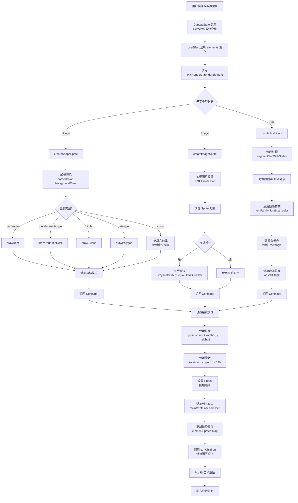

### 渲染架构分层

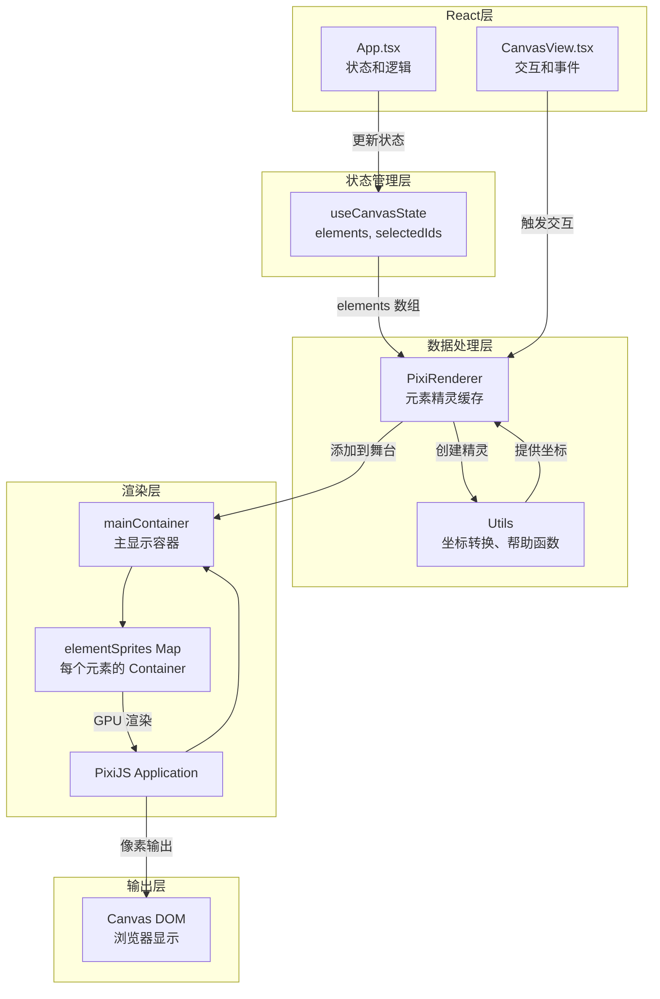

### 关键性能指标

| 阶段 | 操作 | 耗时 | 优化手段 |
|------|------|------|--------|
| 状态更新 | setElements | <1ms | 批量更新 |
| 元素渲染 | createShapeSprite | 0.5-2ms | 复用 Graphics |
| 图片加载 | PIXI.Assets.load | 100-500ms | 异步加载、缓存 |
| 文本分段 | segmentTextWithStyles | 0.2-1ms | 缓存分段结果 |
| 精灵添加 | mainContainer.addChild | <0.1ms | 批量操作 |
| PixiJS 渲染 | GPU 渲染 | 16ms/帧 | WebGL 硬件加速 |
| 自动保存 | localStorage.setItem | 10-50ms | 防抖 500ms |

---

## 图形元素渲染

### 功能概述

支持至少 3 种不同图形的渲染，包括：
- ✅ **矩形** (Rectangle)
- ✅ **圆角矩形** (Rounded Rectangle)  
- ✅ **圆形** (Circle)
- ✅ **三角形** (Triangle)
- ✅ **箭头** (Arrow)

### 数据结构

```typescript
interface ShapeElement extends BaseElement {
  type: 'rectangle' | 'rounded-rectangle' | 'circle' | 'triangle' | 'arrow';
  backgroundColor: string;      // 填充颜色
  borderWidth: number;          // 边框宽度
  borderColor: string;          // 边框颜色
  cornerRadius?: number;        // 圆角矩形的圆角半径
  content?: string;             // 形状内文本内容
  textStyle?: TextStyle;        // 形状内文本样式
  arrowStart?: Point;           // 箭头起点（仅箭头）
  arrowEnd?: Point;             // 箭头终点（仅箭头）
  arrowHeadSize?: number;       // 箭头头部大小
  arrowTailWidth?: number;      // 箭头尾部宽度
  arrowCurve?: number;          // 箭头曲度参数
}
```

### 实现流程

#### 1. 矩形和圆角矩形渲染

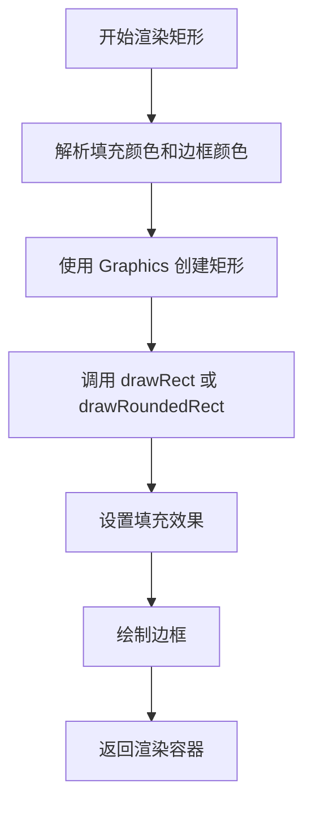

**核心代码逻辑（PixiRenderer.ts）：**

```typescript
case 'rectangle':
  graphics.beginFill(bgColor);
  graphics.drawRect(0, 0, element.width, element.height);
  graphics.endFill();
  if (element.borderWidth > 0) {
    graphics.stroke({ width: element.borderWidth, color: borderColor });
  }
  break;

case 'rounded-rectangle':
  graphics.beginFill(bgColor);
  graphics.drawRoundedRect(
    0, 0, 
    element.width, element.height, 
    element.cornerRadius || 10
  );
  graphics.endFill();
  if (element.borderWidth > 0) {
    graphics.stroke({ width: element.borderWidth, color: borderColor });
  }
  break;
```

**关键点：**
- 使用 PixiJS `Graphics` 对象进行矢量绘制
- `cornerRadius` 参数控制圆角半径（单位：像素）
- 边框通过 `stroke()` 方法绘制，支持自定义宽度和颜色

#### 2. 圆形和三角形渲染

**圆形：** 使用 `drawEllipse()` 方法，宽度和高度相等时为正圆

```typescript
case 'circle':
  graphics.beginFill(bgColor);
  graphics.drawEllipse(
    element.width / 2,
    element.height / 2,
    element.width / 2,
    element.height / 2
  );
  graphics.endFill();
```

**三角形：** 使用 `moveTo()`、`lineTo()` 和 `closePath()` 绘制多边形

```typescript
case 'triangle':
  graphics.beginFill(bgColor);
  graphics.moveTo(element.width / 2, 0);           // 顶点
  graphics.lineTo(element.width, element.height); // 右下
  graphics.lineTo(0, element.height);             // 左下
  graphics.closePath();
  graphics.endFill();
```

#### 3. 箭头渲染

**箭头的复杂性：**
- 支持直线箭头和曲线箭头
- 支持自定义箭头头部大小和尾部宽度
- 需要计算箭头几何体（方向向量、法向量等）

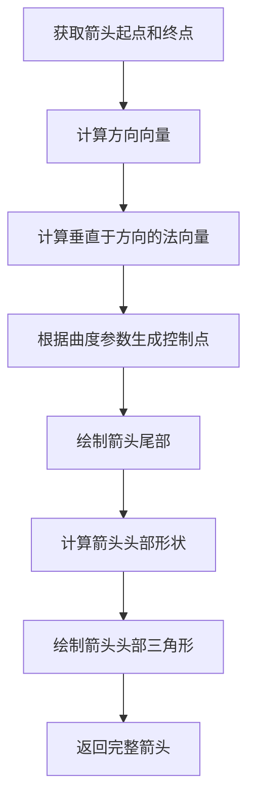

**关键计算：**

```typescript
const dx = end.x - start.x;
const dy = end.y - start.y;
const distance = Math.sqrt(dx * dx + dy * dy) || 1;

// 单位方向向量
const unitX = dx / distance;
const unitY = dy / distance;

// 垂直于方向的法向量（用于曲度）
const normalX = -dy / distance;
const normalY = dx / distance;

// 曲度控制点
const curveStrength = curve * distance * 0.5;
const controlPoint = {
  x: midX + normalX * curveStrength,
  y: midY + normalY * curveStrength
};

// 绘制曲线箭头
if (controlPoint) {
  graphics.quadraticCurveTo(controlPoint.x, controlPoint.y, end.x, end.y);
}

// 计算箭头头部顶点
const tipPoints = calculateArrowHead(end, unitX, unitY, headSize);
```

**参数含义：**
- `arrowCurve`: -1 到 1 之间，控制曲度强度
- `arrowHeadSize`: 箭头头部大小（像素）
- `arrowTailWidth`: 箭头线条宽度（像素）

---

## 图片渲染与滤镜

### 功能概述

- ✅ 支持 PNG、JPEG 格式
- ✅ 支持 3 种简单滤镜：灰度、棕褐色、模糊
- ✅ 支持图片缩放和旋转

### 数据结构

```typescript
interface ImageElement extends BaseElement {
  type: 'image';
  src: string;           // 图片 URL 或 Data URL
  filter: ImageFilter;   // 滤镜类型
}

enum ImageFilter {
  GRAYSCALE = 'grayscale',
  SEPIA = 'sepia',
  BLUR = 'blur',
  NONE = 'none'
}
```

### 滤镜实现原理

PixiJS 通过 **Filter** 对象实现图片滤镜。每种滤镜对应一对 GLSL 着色器程序：

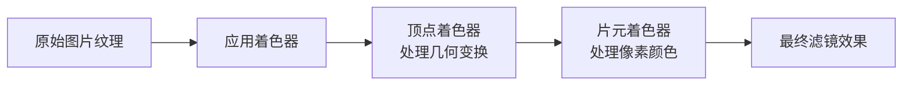

### 滤镜类型详解

#### 1. 灰度滤镜（Grayscale）

**原理：** 将 RGB 三通道合并为单色

```glsl
// 片元着色器伪代码
float gray = 0.299 * R + 0.587 * G + 0.114 * B;
outputColor = vec3(gray, gray, gray);
```

#### 2. 棕褐色滤镜（Sepia）

**原理：** 应用棕褐色色调矩阵变换

```glsl
// 色调矩阵变换
R' = 0.393*R + 0.769*G + 0.189*B
G' = 0.349*R + 0.686*G + 0.168*B
B' = 0.272*R + 0.534*G + 0.131*B
```

#### 3. 模糊滤镜（Blur）

**原理：** 卷积核模糊（高斯模糊）

```glsl
// 9 点高斯模糊核
float kernel[9] = [1, 2, 1, 2, 4, 2, 1, 2, 1] / 16.0
```

### 渲染流程

```typescript
// PixiRenderer.ts
private async createImageSprite(element: ImageElement): Promise<PIXI.Container> {
  const container = new PIXI.Container();
  
  // 1. 加载图片纹理
  const texture = await PIXI.Assets.load(element.src);
  
  // 2. 创建精灵
  const sprite = new PIXI.Sprite(texture);
  sprite.width = element.width;
  sprite.height = element.height;
  
  // 3. 应用滤镜
  if (element.filter && element.filter !== 'none') {
    const filter = this.getFilterByType(element.filter);
    sprite.filters = [filter];
  }
  
  container.addChild(sprite);
  return container;
}

private getFilterByType(filter: ImageFilter): PIXI.Filter {
  switch (filter) {
    case 'grayscale':
      return new PIXI.GrayscaleFilter();
    case 'sepia':
      return new PIXI.SepiaFilter();
    case 'blur':
      return new PIXI.BlurFilter();
    default:
      return new PIXI.Filter();
  }
}
```

---

## 富文本文字渲染

### 功能概述

- ✅ 支持多种字体
- ✅ 支持字号调整
- ✅ 支持文字颜色和背景色
- ✅ 支持文字样式（粗体、斜体、下划线、删除线）
- ✅ 支持范围样式混搭（部分文字应用不同样式）

### 数据结构

```typescript
interface TextStyle {
  fontFamily: string;      // 字体名称，如 'Arial'
  fontSize: number;        // 字号，单位像素
  color: string;          // 文字颜色，十六进制
  backgroundColor?: string; // 背景色
  bold?: boolean;         // 粗体
  italic?: boolean;       // 斜体
  underline?: boolean;    // 下划线
  strikethrough?: boolean; // 删除线
}

interface TextRangeStyle {
  start: number;          // 样式应用的起始位置
  end: number;           // 样式应用的结束位置
  bold?: boolean;
  italic?: boolean;
  underline?: boolean;
  strikethrough?: boolean;
  color?: string;
  backgroundColor?: string;
  fontSize?: number;
  fontFamily?: string;
}

interface TextElement extends BaseElement {
  type: 'text';
  content: string;        // 文字内容
  style: TextStyle;       // 基础样式
  rangeStyles?: TextRangeStyle[]; // 范围样式列表
}
```

### 范围样式实现原理

**问题：** PixiJS 的 `Text` 对象不原生支持范围样式，需要自行分段渲染。

**方案：** 文本分段（Segmentation）+ 多精灵组合

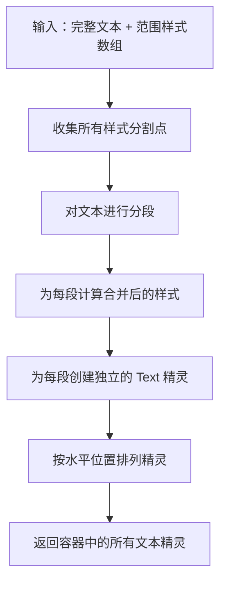

### 分段算法详解

```typescript
// textStyles.ts
export const segmentTextWithStyles = (
  content: string,
  baseStyle: TextStyle,
  rangeStyles?: TextRangeStyle[]
): TextSegment[] => {
  // 1. 收集所有分割点
  const positions: Set<number> = new Set([0, content.length]);
  
  rangeStyles?.forEach((range) => {
    positions.add(Math.max(0, range.start));
    positions.add(Math.min(content.length, range.end));
  });
  
  // 2. 排序分割点
  const sortedPositions = Array.from(positions).sort((a, b) => a - b);
  
  // 3. 为每段计算样式
  for (let i = 0; i < sortedPositions.length - 1; i++) {
    const start = sortedPositions[i];
    const end = sortedPositions[i + 1];
    const text = content.substring(start, end);
    
    // 合并该范围内的所有样式
    let segmentStyle: TextStyle = { ...baseStyle };
    
    rangeStyles?.forEach((range) => {
      // 检查当前段落是否与样式范围重叠
      if (!(range.end <= start || range.start >= end)) {
        segmentStyle = { ...segmentStyle, ...range };
      }
    });
    
    segments.push({ text, style: segmentStyle, start, end });
  }
  
  return segments;
};
```

### 文本渲染流程

```typescript
private createTextSprite(element: TextElement): PIXI.Container {
  const container = new PIXI.Container();
  
  // 1. 分段处理
  const segments = segmentTextWithStyles(
    element.content,
    element.style,
    (element as any).rangeStyles
  );
  
  // 2. 为每段创建 Text 对象
  let offsetX = 0;
  
  segments.forEach((segment) => {
    // 构建 PIXI Text 样式
    const pixiStyle = new PIXI.TextStyle({
      fontFamily: segment.style.fontFamily,
      fontSize: segment.style.fontSize,
      fill: segment.style.color,
      fontWeight: segment.style.bold ? 'bold' : 'normal',
      fontStyle: segment.style.italic ? 'italic' : 'normal',
      decoration: segment.style.underline ? 'underline' : 'none',
      // 注意：strikethrough 需要通过自定义实现
    });
    
    // 创建文本精灵
    const text = new PIXI.Text({
      text: segment.text,
      style: pixiStyle
    });
    
    text.position.x = offsetX;
    
    // 处理背景色（自行绘制矩形）
    if (segment.style.backgroundColor) {
      const bg = new PIXI.Graphics();
      bg.beginFill(segment.style.backgroundColor);
      bg.drawRect(0, 0, text.width, text.height);
      bg.endFill();
      container.addChildAt(bg, 0);
    }
    
    container.addChild(text);
    offsetX += text.width;
  });
  
  return container;
}
```

---

## 交互系统

### 功能概述

### 1. 元素选择

**支持三种选择模式：**

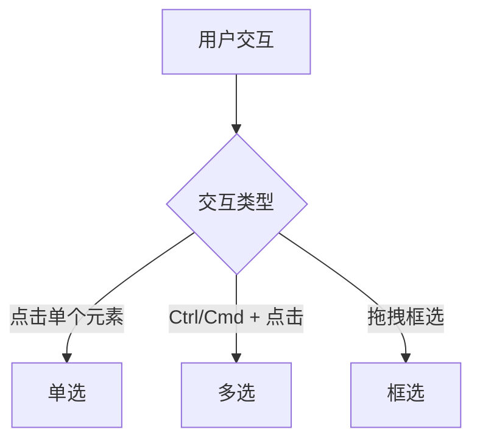

#### 点击选中

```typescript
// CanvasView.tsx
const handleMouseDown = (e: React.MouseEvent) => {
  const { x, y } = screenToCanvas(e.clientX, e.clientY, viewport);
  
  // 逆序遍历元素（zIndex 大的优先选中）
  for (let i = elements.length - 1; i >= 0; i--) {
    if (isPointInElement(x, y, elements[i])) {
      const elementId = elements[i].id;
      
      if (e.ctrlKey || e.metaKey) {
        // Ctrl/Cmd + 点击：多选
        setSelectedIds(prev => {
          return prev.includes(elementId)
            ? prev.filter(id => id !== elementId)
            : [...prev, elementId];
        });
      } else {
        // 普通点击：单选
        setSelectedIds([elementId]);
      }
      
      return;
    }
  }
  
  // 没有点击到元素，清除选择
  onClearSelection();
};
```

#### 框选

```typescript
// 数据结构
interface SelectionBox {
  startX: number;
  startY: number;
  endX: number;
  endY: number;
}

// 检测元素是否在框选范围内
export const isElementInSelection = (
  element: CanvasElement,
  selection: SelectionBox
): boolean => {
  const minX = Math.min(selection.startX, selection.endX);
  const maxX = Math.max(selection.startX, selection.endX);
  const minY = Math.min(selection.startY, selection.endY);
  const maxY = Math.max(selection.startY, selection.endY);
  
  // 对于未旋转的元素，使用简单 AABB 碰撞检测
  if (!element.rotation || element.rotation === 0) {
    return (
      element.x >= minX &&
      element.x + element.width <= maxX &&
      element.y >= minY &&
      element.y + element.height <= maxY
    );
  }
  
  // 对于旋转的元素，检查边界框是否与选区重叠
  const bbox = getBoundingBox([element]);
  return (
    bbox.x >= minX &&
    bbox.x + bbox.width <= maxX &&
    bbox.y >= minY &&
    bbox.y + bbox.height <= maxY
  );
};
```

### 2. 元素拖拽

**拖拽流程：**

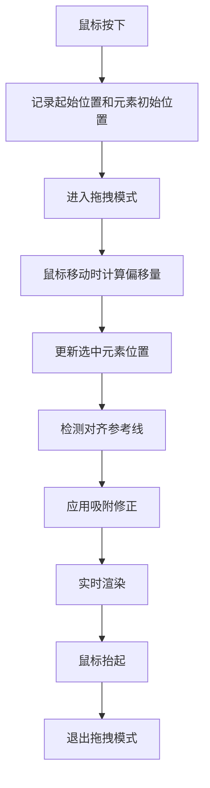

**核心代码：**

```typescript
const [elementStartPos, setElementStartPos] = useState<
  Map<string, { x: number; y: number }>
>(new Map());

const handleMouseMove = (e: React.MouseEvent) => {
  if (mode !== InteractionMode.DRAGGING) return;
  
  const { x: canvasX, y: canvasY } = screenToCanvas(
    e.clientX, 
    e.clientY, 
    viewport
  );
  
  // 计算拖拽偏移
  const deltaX = canvasX - dragStart.x;
  const deltaY = canvasY - dragStart.y;
  
  // 更新每个选中元素的位置
  selectedIds.forEach((id) => {
    const startPos = elementStartPos.get(id);
    if (startPos) {
      const newX = startPos.x + deltaX;
      const newY = startPos.y + deltaY;
      
      onUpdateElement(id, { x: newX, y: newY });
    }
  });
  
  // 检测参考线并应用吸附
  const movingElements = elements.filter(e => selectedIds.includes(e.id));
  const otherElements = elements.filter(e => !selectedIds.includes(e.id));
  
  const guidelines = detectGuideLines(
    movingElements[0],
    otherElements,
    viewport
  );
  setGuidelines(guidelines);
};
```

### 3. 元素缩放

**支持 8 个缩放控制点：**

```
    T (Top)
    ↑
L ← + → R
    ↓
    B (Bottom)

对角：TL, TR, BL, BR
```

**缩放算法：**

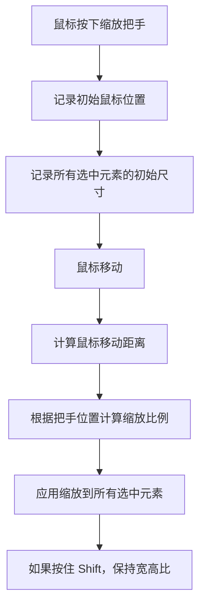

**实现细节：**

```typescript
const handleResizeHandleDown = (handle: string) => {
  const resizeStartData = {
    mouseX: e.clientX,
    mouseY: e.clientY,
    elements: new Map(
      selectedIds.map(id => {
        const el = elements.find(x => x.id === id)!;
        return [id, { x: el.x, y: el.y, width: el.width, height: el.height }];
      })
    ),
    shiftKey: e.shiftKey
  };
  
  setResizeHandle(handle);
  setResizeStartData(resizeStartData);
  setMode(InteractionMode.RESIZING);
};

const handleMouseMove = (e: React.MouseEvent) => {
  if (mode !== InteractionMode.RESIZING) return;
  
  const deltaX = e.clientX - resizeStartData.mouseX;
  const deltaY = e.clientY - resizeStartData.mouseY;
  
  resizeStartData.elements.forEach((startPos, elementId) => {
    let newWidth = startPos.width;
    let newHeight = startPos.height;
    let newX = startPos.x;
    let newY = startPos.y;
    
    // 根据把手类型计算新尺寸
    switch (resizeHandle) {
      case 'r': // 右边
        newWidth = startPos.width + deltaX;
        break;
      case 'b': // 下边
        newHeight = startPos.height + deltaY;
        break;
      case 'br': // 右下角
        newWidth = startPos.width + deltaX;
        newHeight = startPos.height + deltaY;
        break;
      // ... 其他情况
    }
    
    // 保持宽高比（如果按住 Shift）
    if (resizeStartData.shiftKey) {
      const aspectRatio = startPos.width / startPos.height;
      newHeight = newWidth / aspectRatio;
    }
    
    onUpdateElement(elementId, {
      x: newX,
      y: newY,
      width: Math.max(10, newWidth),
      height: Math.max(10, newHeight)
    });
  });
};
```

### 4. 对齐参考线（Snapping Guide Lines）

**功能说明：** 当元素被拖拽时，如果接近其他元素的对齐点，会显示对齐参考线并自动吸附。

**对齐类型：**

```
Left    Center    Right       Top    Middle   Bottom
|       |         |           —      —        —
|       |         |           —      —        —
```

**实现原理：**

```typescript
export const detectGuideLines = (
  movingElement: CanvasElement,
  otherElements: CanvasElement[],
  viewport: { x: number; y: number; scale: number }
): GuideLine[] => {
  const guidelines: GuideLine[] = [];
  const movingAlignments = getElementAlignments(movingElement);
  const snapDist = SNAP_DISTANCE / viewport.scale; // 10 像素吸附距离
  
  otherElements.forEach((otherElement) => {
    const otherAlignments = getElementAlignments(otherElement);
    
    // 检测垂直对齐（left, right, centerX）
    ['left', 'right', 'centerX'].forEach((alignType) => {
      const movingPos = movingAlignments[alignType];
      const otherPos = otherAlignments[alignType];
      const distance = Math.abs(movingPos - otherPos);
      
      if (distance < snapDist && distance > 0) {
        guidelines.push({
          type: 'vertical',
          position: otherPos,
          start: Math.min(movingElement.y, otherElement.y),
          end: Math.max(
            movingElement.y + movingElement.height,
            otherElement.y + otherElement.height
          )
        });
      }
    });
    
    // 检测水平对齐（top, bottom, centerY）
    ['top', 'bottom', 'centerY'].forEach((alignType) => {
      // 类似逻辑...
    });
  });
  
  return guidelines;
};
```

---

## 数据结构设计

### 核心类型体系

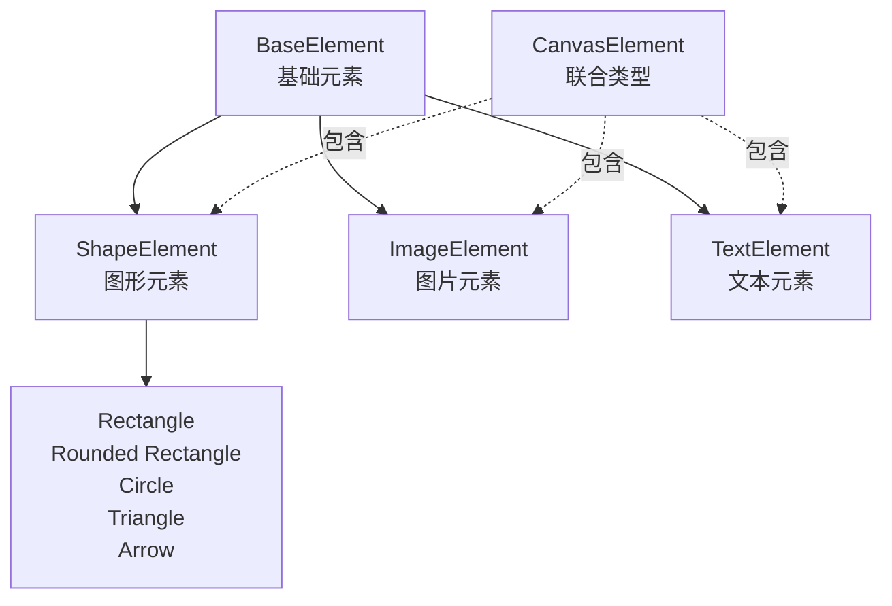

### 详细字段说明

#### BaseElement（所有元素的基础）

| 字段 | 类型 | 说明 |
|------|------|------|
| id | string | 唯一标识符，格式：`{timestamp}-{randomId}` |
| type | ElementType | 元素类型枚举值 |
| x | number | 元素左上角 X 坐标 |
| y | number | 元素左上角 Y 坐标 |
| width | number | 元素宽度（像素） |
| height | number | 元素高度（像素） |
| rotation | number | 旋转角度（0-360°） |
| zIndex | number | 图层顺序（数值越大越在上方） |

#### ShapeElement（图形元素特定字段）

| 字段 | 类型 | 说明 |
|------|------|------|
| backgroundColor | string | 填充颜色，十六进制格式 #RRGGBB |
| borderWidth | number | 边框宽度（像素） |
| borderColor | string | 边框颜色 |
| cornerRadius | number? | 圆角半径（仅圆角矩形） |
| arrowStart | Point? | 箭头起点坐标 {x, y} |
| arrowEnd | Point? | 箭头终点坐标 {x, y} |
| arrowHeadSize | number? | 箭头头部大小 |
| arrowTailWidth | number? | 箭头尾部宽度 |
| arrowCurve | number? | 箭头曲度参数 (-1 到 1) |

#### ImageElement（图片元素特定字段）

| 字段 | 类型 | 说明 |
|------|------|------|
| src | string | 图片 URL 或 Data URL |
| filter | ImageFilter | 滤镜类型枚举 |

#### TextElement（文本元素特定字段）

| 字段 | 类型 | 说明 |
|------|------|------|
| content | string | 文本内容 |
| style | TextStyle | 基础文本样式 |
| rangeStyles | TextRangeStyle[]? | 范围样式数组 |

### 视口状态（ViewportState）

```typescript
interface ViewportState {
  x: number;        // 视口在画布上的 X 偏移
  y: number;        // 视口在画布上的 Y 偏移
  scale: number;    // 缩放比例（1.0 = 100%）
}
```

**转换关系：**

```
屏幕坐标 → 画布坐标：
canvasX = screenX / scale - viewportX
canvasY = screenY / scale - viewportY

画布坐标 → 屏幕坐标：
screenX = (canvasX + viewportX) * scale
screenY = (canvasY + viewportY) * scale
```

---

## 状态管理

### useCanvasState Hook 架构

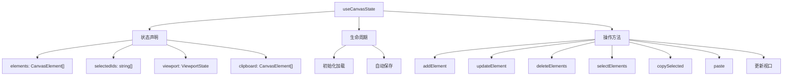

### 关键操作详解

#### 1. 添加元素

```typescript
const addElement = useCallback((element: CanvasElement) => {
  setElements((prev) => [...prev, element]);
}, []);
```

**特点：** 新元素自动追加到数组末尾，zIndex 自动递增

#### 2. 更新元素

```typescript
const updateElement = useCallback((id: string, updates: Partial<CanvasElement>) => {
  setElements((prev) =>
    prev.map((el) => (el.id === id ? { ...el, ...updates } : el))
  );
}, []);
```

**特点：** 对箭头元素有特殊处理，缩放时自动调整箭头端点

#### 3. 删除元素

```typescript
const deleteElements = useCallback((ids: string[]) => {
  setElements((prev) => prev.filter((el) => !ids.includes(el.id)));
  setSelectedIds((prev) => prev.filter((id) => !ids.includes(id)));
}, []);
```

**特点：** 删除后自动清除相关选择状态

#### 4. 复制和粘贴

```typescript
const copySelected = useCallback(() => {
  const selectedElements = elements.filter((el) => selectedIds.includes(el.id));
  setClipboard(selectedElements.map(cloneElement));
}, [elements, selectedIds]);

const paste = useCallback(() => {
  const pastedElements = clipboard.map((el) => {
    // 产生新 ID，位置偏移
    return {
      ...cloneElement(el),
      id: generateId(),
      x: el.x + 20,
      y: el.y + 20,
    };
  });
  
  setElements((prev) => [...prev, ...pastedElements]);
  setSelectedIds(pastedElements.map((el) => el.id));
}, [clipboard]);
```

### 自动保存机制

```typescript
const debouncedSave = useCallback(
  debounce((state: CanvasState) => {
    saveCanvasState(state);
  }, 500), // 500ms 防抖
  []
);

useEffect(() => {
  if (!initialized) return;
  debouncedSave({ elements, selectedIds, viewport });
}, [elements, viewport, selectedIds, debouncedSave, initialized]);
```

**特点：**
- **防抖处理**：避免频繁保存，500ms 延迟
- **初始化检查**：确保不会过早保存空状态
- **自动持久化**：每次状态变化自动保存到 LocalStorage

---

## 坐标系统

### 坐标转换

**屏幕坐标 ↔ 画布坐标**

```typescript
export const screenToCanvas = (
  screenX: number,
  screenY: number,
  viewport: ViewportState
): { x: number; y: number } => {
  return {
    x: (screenX - viewport.x) / viewport.scale,
    y: (screenY - viewport.y) / viewport.scale,
  };
};

export const canvasToScreen = (
  canvasX: number,
  canvasY: number,
  viewport: ViewportState
): { x: number; y: number } => {
  return {
    x: canvasX * viewport.scale + viewport.x,
    y: canvasY * viewport.scale + viewport.y,
  };
};
```

### 旋转坐标计算

对于旋转的元素，点击检测需要反向旋转：

```
原始坐标系
    ↑ Y
    |
────┼───→ X
    |

旋转后
    ↑ Y' (旋转 θ°)
    |
────┼───→ X'
    |

反向旋转公式：
X_rotated = X * cos(-θ) - Y * sin(-θ)
Y_rotated = X * sin(-θ) + Y * cos(-θ)
```

---

## 性能优化

### 1. 渲染优化

- **脏标记**：仅在元素变化时重新渲染
- **容器隔离**：每个元素独立的 PIXI.Container，便于删除和更新
- **图层排序**：使用 zIndex 和 `sortChildren()` 维持画布顺序

### 2. 状态优化

- **防抖保存**：LocalStorage 写入 500ms 防抖
- **选择缓存**：selectedIds 使用数组，快速查找使用 Set
- **字段合并**：updateElement 使用浅合并，避免深复制开销

### 3. 交互优化

- **拖拽阈值**：5 像素阈值，避免误触发
- **参考线吸附**：10 像素吸附距离，平衡易用性和精度

---

## 总结表

| 功能模块 | 核心文件 | 数据结构 | 关键方法 |
|---------|--------|--------|--------|
| 图形渲染 | PixiRenderer.ts | ShapeElement | createShapeSprite() |
| 图片滤镜 | PixiRenderer.ts | ImageElement | getFilterByType() |
| 文本渲染 | PixiRenderer.ts, textStyles.ts | TextElement, TextSegment | segmentTextWithStyles() |
| 交互系统 | CanvasView.tsx | SelectionBox, ResizeHandle | handleMouseDown/Move |
| 对齐吸附 | guideLines.ts | GuideLine | detectGuideLines() |
| 状态管理 | useCanvasState.ts | CanvasState | addElement, updateElement |
| 持久化 | storage.ts | - | saveCanvasState() |

